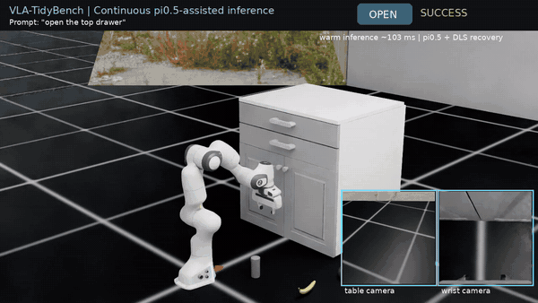
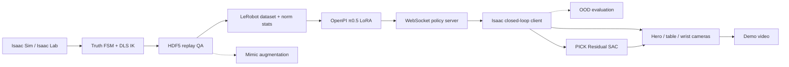
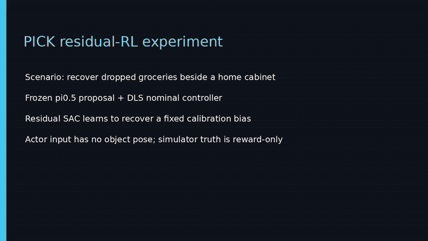
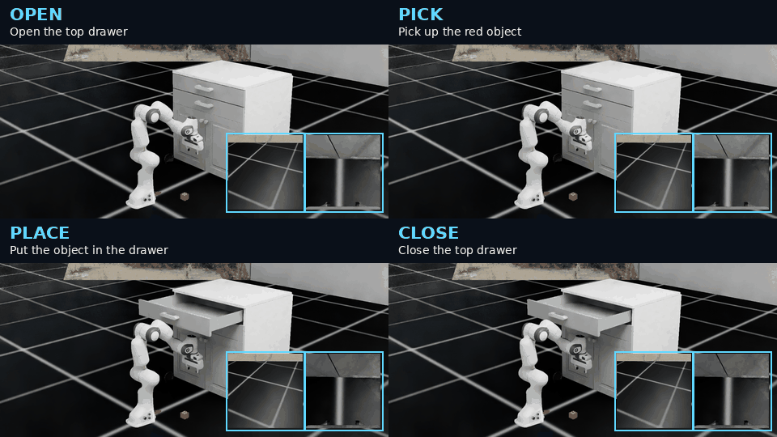
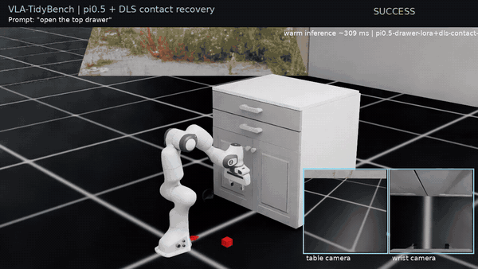
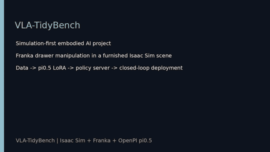
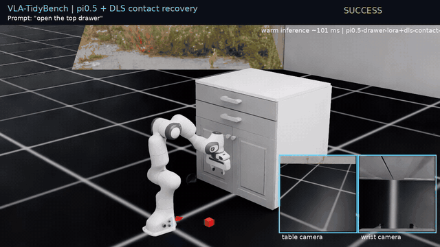

# VLA-TidyBench

VLA-TidyBench 是一个面向具身智能工程实践的仿真项目：在 Isaac Sim / Isaac Lab 中使用 Franka Panda 完成抽屉整理任务，并贯通自动示范采集、LeRobot 数据转换、OpenPI π0.5 LoRA、策略服务、闭环部署、残差强化学习和多机位演示。最终落地场景是家庭药品收纳：机器人打开抽屉，拾取掉落的药瓶，将其放入抽屉并关闭抽屉。

目标任务：**Open the drawer → pick an object → place it in the drawer → close the drawer.**

<p align="center">
  
</p>

上图是一个无重置、无技能间剪切的连续成功 episode：OPEN → PICK 药瓶 → PLACE → CLOSE，共 438 个控制步。三机位完整视频见[连续药瓶长任务 MP4](docs/media/pi05-continuous-medicine-demo.mp4)。四个原子技能的 2×2 展示、完整项目成片和强化学习对照见文末演示区。

## 项目概览

项目以“先跑通完整链路，再逐步提升策略能力”为工程路线，核心内容包括：

- Isaac Sim 6.0.1、Isaac Lab 3.0 beta2 与 Franka Panda 抽屉场景。
- 7D 相对末端动作：`[dx, dy, dz, dRx, dRy, dRz, gripper]`，通过 DLS 逆运动学执行。
- 物体真值定位、有限状态机规划和自动示范采集；训练数据只保留 RGB、本体状态、语言和动作。
- HDF5 回放检查、LeRobot 数据转换和归一化统计量计算。
- OpenPI π0.5 LoRA 短训练、Orbax checkpoint 恢复与 WebSocket 策略服务。
- Isaac 闭环客户端、动作适配、安全约束和三机位同步录制。
- Mimic 数据扩增、OOD 评测和冻结 VLA 残差强化学习的扩展接口。

## 系统架构



推荐的双 GPU 分工：GPU 0 运行 Isaac Sim 与相机，GPU 1 运行 π0.5 推理；LoRA 训练阶段使用两张 GPU 做 FSDP。

## 实测结果

| 环节 | 结果 |
| --- | --- |
| OPEN 示范数据 | 8 个成功 episode，1,092 帧，20 Hz |
| π0.5 LoRA | 2× RTX 4090，500 steps，最终 loss `0.0316` |
| 模型输出 | `(16, 7)` action chunk |
| 推理延迟 | 首次 JIT 约 17 s；预热后约 96 ms |
| 场景资产 | Isaac `Simple_Room`、带质量/碰撞/摩擦的药瓶、香蕉、碗、杯子和家具抽屉 |
| 纯 π0.5 闭环 | `K=1/4/16` 均未稳定建立把手接触 |
| π0.5 + DLS contact recovery | 94 步打开至 `0.303 m`，成功阈值 `0.30 m`，平均推理约 101 ms |
| 四技能最小训练 | 4 个 episode、684 帧、200 steps；单一语言条件 checkpoint |
| 四技能展示 | OPEN / PICK / PLACE / CLOSE 四段成功轨迹 |
| 连续药瓶长任务 | 单 episode、438 步、技能间 0 次 reset；平均推理 `103.09 ms` |
| PICK Residual SAC | 200 steps；零残差基线 0/1，deterministic 评测 3/3，67 步抬升罐头至 `0.1201 m` |

顶部连续 GIF 使用同一 Isaac episode 中的在线 π0.5 action proposal 与 DLS 安全恢复控制，记录每步语言、模型动作、教师阶段和最终执行动作。它验证了模型服务、动态技能提示、Isaac 闭环、物理抓取和多机位录制能够在一条长轨迹中贯通。

### 连续药瓶长任务

药瓶使用仓库内的程序化 USD 资产，包含瓶身、瓶盖、标签、红十字、碰撞体、质量与摩擦参数。连续 episode 在四个阶段分别发送 `open the top drawer`、`pick up the medicine bottle`、`put the medicine bottle into the top drawer` 和 `close the top drawer`。200-step checkpoint 沿用早期日用品四技能小数据训练，没有为药瓶重新训练；本次演示用于验证新资产和新语言提示下的部署迁移。π0.5 每 4 步重规划一次，受限残差权重为 `0.0001`；DLS 状态机负责接触安全和失败恢复。因此这是 **π0.5-assisted closed loop**，不是纯 π0.5 自主成功，仓库不会把混合控制结果误标为纯模型结果。

终端一启动四技能策略服务：

```bash
OPENPI_CUDA_VISIBLE_DEVICES=1 \
./scripts/run_openpi.sh scripts/serve_drawer_policy.py \
  --checkpoint /home/ubuntu/data/vla-tidybench/checkpoints/openpi-runs/\
pi05_tidybench_drawer_four_skill_lora/four_skill_min_200/199 \
  --port 8000 --four-skill
```

终端二录制同一 episode 的完整任务：

```bash
make continuous-medicine-demo

# 等价的完整命令
./scripts/run_isaac.sh scripts/collect_scripted_drawer.py \
  --skill full --num_demos 1 --max_attempts 1 --max_steps 650 --seed 610 --overwrite \
  --dataset_file /home/ubuntu/data/vla-tidybench/eval/drawer_full_medicine_pi05_live.hdf5 \
  --showcase --policy-host 127.0.0.1 --policy-port 8000 \
  --policy-residual-weight 0.0001 --policy-replan-steps 4 \
  --device cuda:0 --enable_cameras --viz none
```

生成三机位视频和 GIF：

```bash
./scripts/run_openpi.sh scripts/render_pi05_showcase.py \
  /home/ubuntu/data/vla-tidybench/eval/drawer_full_medicine_pi05_live.hdf5 \
  docs/media/pi05-continuous-medicine-demo.mp4 --fps 20
make media-gifs
```

### 小数据部署边界

当前小数据 checkpoint 无法独立完成把手接触，因此部署端保留 π0.5 的逐步视觉推理，并将其作为权重 2% 的受限动作残差；回放验证过的 DLS 状态机提供稳定的接触基础动作。该模式在记录文件中分别保存 `policy_actions`、`recovery_base_actions` 和最终 `actions`，不会将混合控制结果标记为纯 π0.5 成功。

早期四技能分段展示使用独立的多技能 LeRobot 数据集和同一个 200-step checkpoint。OPEN、PICK 使用 2% 模型残差，CLOSE 使用 0.2%，PLACE 使用零残差安全回退；所有片段仍执行并保存 π0.5 action proposal。最终连续药瓶演示使用更保守的统一 `0.0001` 残差，以最低训练预算验证从多语言数据到在线推理、恢复控制和长视频交付的完整链路。

```bash
./scripts/run_openpi.sh scripts/convert_stack_to_lerobot.py \
  --config configs/data/drawer_four_skill_mvp.json \
  --data-root /home/ubuntu/data/vla-tidybench/raw --overwrite

./scripts/run_openpi.sh scripts/compute_drawer_norm_stats.py --four-skill

OPENPI_CUDA_VISIBLE_DEVICES=0,1 \
./scripts/run_openpi.sh scripts/train_drawer_pi05.py \
  --four-skill --steps 200 --batch-size 2 --fsdp-devices 2 \
  --exp-name four_skill_min_200 --overwrite
```

```bash
./scripts/run_isaac.sh scripts/run_drawer_pi05_closed_loop.py \
  --device cuda:0 --enable_cameras --viz none \
  --host 127.0.0.1 --port 8000 --seed 300 \
  --max-steps 180 --execute-steps 1 --showcase \
  --dls-contact-recovery --policy-residual-weight 0.02 \
  --output /home/ubuntu/data/vla-tidybench/eval/pi05_dls_recovery_success_showcase.hdf5
```

[观看 π0.5 + DLS OPEN 成功视频](docs/media/pi05-dls-recovery-open-success.mp4)

### PICK 残差强化学习实验

强化学习扩展针对一个具体工程问题：末端执行器存在固定的 x 轴标定偏差时，原本可用的 PICK 控制器无法对准目标。实验冻结已有控制链，将 DLS 名义动作与历史 π0.5 action proposal 组合为 base action，只让一个轻量 SAC actor 输出受限的 x 轴残差；动作适配器再将其映射回标准 6D 末端残差，夹爪通道始终由 base action 控制。

该强化学习实验是最终药瓶场景之前冻结的番茄汤罐标定实验，目标是带碰撞、质量和纹理的 `YCB/005_tomato_soup_can`，不冒充药瓶版本的重新训练结果。actor 只能读取关节状态、末端位姿、名义动作、上一动作、技能阶段和 episode 进度；物体位姿只用于训练奖励和成功判定。

为缩短项目末期训练时间，actor 以已测得的标定补偿作为 mean-action warm start，再进行 200 步低熵 SAC 微调。这是 warm-started residual RL，不是从零探索，也没有更新 π0.5 参数。最终结果为：相同 3.5 cm 等效偏差下，零残差基线在 110 步内失败；SAC checkpoint 在 3 个固定评测 episode 中全部成功，约 67 步将罐头抬升至 `0.1201 m`。

```bash
# 训练并做 deterministic 评测
RL_STEPS=200 make pick-rl-train

# 三机位录制成功轨迹
make pick-rl-record

# 生成 baseline 与 RL 对比视频
FFMPEG_BIN=/path/to/ffmpeg ./scripts/run_openpi.sh scripts/render_pick_rl_demo.py \
  --baseline /home/ubuntu/data/vla-tidybench/eval/pick_residual_tomato_baseline.hdf5 \
  --rl /home/ubuntu/data/vla-tidybench/eval/pick_residual_tomato_rl_success.hdf5 \
  --output docs/media/pick-residual-sac-demo.mp4
```

<p align="center">
  
</p>

[观看 PICK Residual SAC 三机位对比视频（MP4）](docs/media/pick-residual-sac-demo.mp4)

## 快速开始

以下命令默认在已配置好的云服务器环境中运行：

```bash
cd /home/ubuntu/mycode/vla-tidybench
make doctor
make test
```

### 1. 采集 OPEN 数据

```bash
SKILL=open NUM_DEMOS=8 MAX_ATTEMPTS=12 MAX_STEPS=360 SEED=300 \
DATASET_FILE=/home/ubuntu/data/vla-tidybench/raw/drawer_open_mvp.hdf5 \
./scripts/collect_scripted_drawer.sh --overwrite
```

### 2. 转换为 LeRobot 并计算统计量

```bash
./scripts/run_openpi.sh scripts/convert_stack_to_lerobot.py \
  --config configs/data/drawer_open_mvp.json \
  --data-root /home/ubuntu/data/vla-tidybench/raw --overwrite

./scripts/run_openpi.sh scripts/compute_drawer_norm_stats.py
```

### 3. 训练 π0.5 LoRA

```bash
OPENPI_CUDA_VISIBLE_DEVICES=0,1 \
./scripts/run_openpi.sh scripts/train_drawer_pi05.py \
  --steps 500 --batch-size 2 --fsdp-devices 2 \
  --exp-name open_mvp --overwrite
```

### 4. 启动策略服务

```bash
OPENPI_CUDA_VISIBLE_DEVICES=1 \
./scripts/run_openpi.sh scripts/serve_drawer_policy.py \
  --checkpoint /ABS/PATH/TO/CHECKPOINT --port 8000
```

另开终端启动 Isaac 闭环客户端：

```bash
./scripts/run_isaac.sh scripts/run_drawer_pi05_closed_loop.py \
  --device cuda:0 --enable_cameras --viz none \
  --host 127.0.0.1 --port 8000 \
  --max-steps 240 --execute-steps 4 --showcase \
  --output /home/ubuntu/data/vla-tidybench/eval/pi05_open_showcase.hdf5
```

策略观测为 `table RGB + wrist RGB + q/qdot + prompt`。抽屉关节只参与成功判定，不作为模型输入。

### 5. 生成视频 GIF

先生成四个三机位技能轨迹，再运行：

```bash
./scripts/run_openpi.sh scripts/render_readme_gifs.py \
  --open /home/ubuntu/data/vla-tidybench/eval/readme_skills/open.hdf5 \
  --pick /home/ubuntu/data/vla-tidybench/eval/readme_skills/pick.hdf5 \
  --place /home/ubuntu/data/vla-tidybench/eval/readme_skills/place.hdf5 \
  --close /home/ubuntu/data/vla-tidybench/eval/readme_skills/close.hdf5 \
  --final-video artifacts/demo/vla-tidybench-final-project.mp4 \
  --skill-gif docs/media/four-skills-2x2.gif \
  --final-gif docs/media/final-project-preview.gif

# 为 docs/media 中的每个 MP4 生成同名 GIF 预览
make media-gifs
```

## 四个原子技能

```bash
make drawer-open-smoke
make drawer-pick-smoke
make drawer-place-smoke
make drawer-close-smoke
make drawer-demo
```

每个技能都可单独采集、回放和评测，也可以通过任务图组合为完整抽屉整理流程。三机位录制包含：

- `hero_cam`：展示完整机械臂、工作台与抽屉的全景机位。
- `table_cam`：面向任务区域的策略主相机。
- `wrist_cam`：安装在 Franka 末端的近景相机。

## 扩展模块

- **Mimic**：提供官方 Franka stack Mimic smoke 链路，以及抽屉任务的子任务配置入口，可继续扩增原子技能数据。
- **OOD**：`make ood-plan` 生成固定的 ID、视觉、几何和物理评测计划。
- **强化学习**：已完成 PICK 标定恢复实验；冻结 base controller，训练 warm-started Residual SAC，并保留 OPEN residual 与更大规模在线 RL 的扩展配置。

## 仓库结构

```text
configs/                 数据、仿真、Mimic、OOD 与 RL 配置
docs/                    动作规范、部署说明、里程碑与媒体资源
policy_bridge/           WebSocket 协议与 smoke server
scripts/                 采集、转换、训练、闭环与视频脚本
source/vla_tidybench/    可复用 Python 包
tests/                   契约测试和回归测试
results/metrics/         小型 manifest 与指标文件
```

原始数据、模型权重、缓存和云端凭据不提交到 Git。发布前运行：

```bash
make test
make extension-smoke
make prepublish
```

## 最终演示

每个演示视频均提供同名 GIF，可直接在 README 中预览；点击标题可观看带更高画质和完整帧率的 MP4。

| 四个原子技能 2×2 三机位展示 |
| --- |
|  |

| 四技能最小训练成功 | 完整项目成片 |
| --- | --- |
|  |  |
| [观看 MP4](docs/media/pi05-four-skill-minimal-success.mp4) | [观看 MP4](docs/media/vla-tidybench-final-project.mp4) |

| π0.5 + DLS OPEN 成功 | PICK Residual SAC 对比 |
| --- | --- |
|  |  |
| [观看 MP4](docs/media/pi05-dls-recovery-open-success.mp4) | [观看 MP4](docs/media/pick-residual-sac-demo.mp4) |

| 三机位家具场景预览 |
| --- |
|  |
| [观看 MP4](docs/media/vla-tidybench-new-scene-preview.mp4) |

### 最终连续任务：药瓶收纳

| OPEN → PICK → PLACE → CLOSE 连续成功 |
| --- |
|  |
| [观看完整三机位 MP4](docs/media/pi05-continuous-medicine-demo.mp4) |

该 GIF 是项目的最终主展示。Franka 在同一个仿真 episode 中打开抽屉、抓取药瓶、将药瓶放入抽屉并关闭抽屉，四个阶段之间没有重置或轨迹拼接。完整轨迹包含 438 个控制步，以 20 FPS 导出约 21.9 秒的视频；画面同时展示全景、桌面相机和腕部相机。

运行过程中，四技能 π0.5 checkpoint 根据当前阶段接收对应语言提示，每 4 步生成一次动作块；DLS 状态机提供接触安全与失败恢复，最终执行动作包含权重为 `0.0001` 的模型残差。因此该结果定义为 **π0.5-assisted closed loop**，用于证明从语言条件推理、策略服务、仿真执行到视频交付的完整链路已经贯通，而不是宣称纯 π0.5 在小数据条件下独立完成长任务。

分段四技能和 2×2 GIF 用于观察单技能细节；Residual SAC 视频保留为独立的历史番茄罐标定恢复实验。
