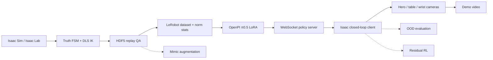
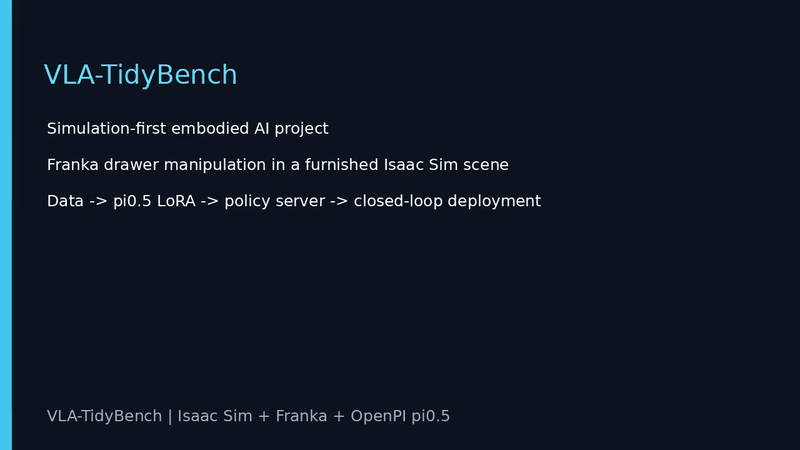

# VLA-TidyBench

VLA-TidyBench 是一个面向具身智能工程实践的仿真项目：在 Isaac Sim / Isaac Lab 中使用 Franka Panda 完成抽屉整理任务，并贯通自动示范采集、LeRobot 数据转换、OpenPI π0.5 LoRA、策略服务、闭环部署和多机位演示。

目标任务：**Open the drawer → pick an object → place it in the drawer → close the drawer.**

<p align="center">
  
</p>

上图同步展示全景、桌面和腕部三个机位下的四个原子技能。完整成片见[最终项目视频](docs/media/vla-tidybench-final-project.mp4)，场景与机位预览见[三机位场景视频](docs/media/vla-tidybench-new-scene-preview.mp4)。

## 项目概览

项目以“先跑通完整链路，再逐步提升策略能力”为工程路线，核心内容包括：

- Isaac Sim 6.0.1、Isaac Lab 3.0 beta2 与 Franka Panda 抽屉场景。
- 7D 相对末端动作：`[dx, dy, dz, dRx, dRy, dRz, gripper]`，通过 DLS 逆运动学执行。
- 物体真值定位、有限状态机规划和自动示范采集；训练数据只保留 RGB、本体状态、语言和动作。
- HDF5 回放检查、LeRobot 数据转换和归一化统计量计算。
- OpenPI π0.5 LoRA 短训练、Orbax checkpoint 恢复与 WebSocket 策略服务。
- Isaac 闭环客户端、动作适配、安全约束和三机位同步录制。
- Mimic 数据扩增、OOD 评测和冻结 VLA 残差强化学习的扩展接口。

## 系统架构



推荐的双 GPU 分工：GPU 0 运行 Isaac Sim 与相机，GPU 1 运行 π0.5 推理；LoRA 训练阶段使用两张 GPU 做 FSDP。

## 实测结果

| 环节 | 结果 |
| --- | --- |
| OPEN 示范数据 | 8 个成功 episode，1,092 帧，20 Hz |
| π0.5 LoRA | 2× RTX 4090，500 steps，最终 loss `0.0316` |
| 模型输出 | `(16, 7)` action chunk |
| 推理延迟 | 首次 JIT 约 17 s；预热后约 96 ms |
| 场景资产 | Isaac `Simple_Room`、YCB 香蕉、碗和杯子 |
| 纯 π0.5 闭环 | `K=1/4/16` 均未稳定建立把手接触 |
| π0.5 + DLS contact recovery | 94 步打开至 `0.303 m`，成功阈值 `0.30 m`，平均推理约 101 ms |

顶部四技能 GIF 使用同一 Isaac 场景中的状态机教师与 DLS IK 生成，用于展示场景、控制器和相机链路；最终视频同时保留真实 π0.5 闭环片段，便于直接比较模型策略与参考技能轨迹。

### 最小成功调整

当前小数据 checkpoint 无法独立完成把手接触，因此部署端保留 π0.5 的逐步视觉推理，并将其作为权重 2% 的受限动作残差；回放验证过的 DLS 状态机提供稳定的接触基础动作。该模式在记录文件中分别保存 `policy_actions`、`recovery_base_actions` 和最终 `actions`，不会将混合控制结果标记为纯 π0.5 成功。

```bash
./scripts/run_isaac.sh scripts/run_drawer_pi05_closed_loop.py \
  --device cuda:0 --enable_cameras --viz none \
  --host 127.0.0.1 --port 8000 --seed 300 \
  --max-steps 180 --execute-steps 1 --showcase \
  --dls-contact-recovery --policy-residual-weight 0.02 \
  --output /home/ubuntu/data/vla-tidybench/eval/pi05_dls_recovery_success_showcase.hdf5
```

[观看 π0.5 + DLS OPEN 成功视频](docs/media/pi05-dls-recovery-open-success.mp4)

## 快速开始

以下命令默认在已配置好的云服务器环境中运行：

```bash
cd /home/ubuntu/mycode/vla-tidybench
make doctor
make test
```

### 1. 采集 OPEN 数据

```bash
SKILL=open NUM_DEMOS=8 MAX_ATTEMPTS=12 MAX_STEPS=360 SEED=300 \
DATASET_FILE=/home/ubuntu/data/vla-tidybench/raw/drawer_open_mvp.hdf5 \
./scripts/collect_scripted_drawer.sh --overwrite
```

### 2. 转换为 LeRobot 并计算统计量

```bash
./scripts/run_openpi.sh scripts/convert_stack_to_lerobot.py \
  --config configs/data/drawer_open_mvp.json \
  --data-root /home/ubuntu/data/vla-tidybench/raw --overwrite

./scripts/run_openpi.sh scripts/compute_drawer_norm_stats.py
```

### 3. 训练 π0.5 LoRA

```bash
OPENPI_CUDA_VISIBLE_DEVICES=0,1 \
./scripts/run_openpi.sh scripts/train_drawer_pi05.py \
  --steps 500 --batch-size 2 --fsdp-devices 2 \
  --exp-name open_mvp --overwrite
```

### 4. 启动策略服务

```bash
OPENPI_CUDA_VISIBLE_DEVICES=1 \
./scripts/run_openpi.sh scripts/serve_drawer_policy.py \
  --checkpoint /ABS/PATH/TO/CHECKPOINT --port 8000
```

另开终端启动 Isaac 闭环客户端：

```bash
./scripts/run_isaac.sh scripts/run_drawer_pi05_closed_loop.py \
  --device cuda:0 --enable_cameras --viz none \
  --host 127.0.0.1 --port 8000 \
  --max-steps 240 --execute-steps 4 --showcase \
  --output /home/ubuntu/data/vla-tidybench/eval/pi05_open_showcase.hdf5
```

策略观测为 `table RGB + wrist RGB + q/qdot + prompt`。抽屉关节只参与成功判定，不作为模型输入。

### 5. 生成四技能与最终视频 GIF

先生成四个三机位技能轨迹，再运行：

```bash
./scripts/run_openpi.sh scripts/render_readme_gifs.py \
  --open /home/ubuntu/data/vla-tidybench/eval/readme_skills/open.hdf5 \
  --pick /home/ubuntu/data/vla-tidybench/eval/readme_skills/pick.hdf5 \
  --place /home/ubuntu/data/vla-tidybench/eval/readme_skills/place.hdf5 \
  --close /home/ubuntu/data/vla-tidybench/eval/readme_skills/close.hdf5 \
  --final-video artifacts/demo/vla-tidybench-final-project.mp4 \
  --skill-gif docs/media/four-skills-2x2.gif \
  --final-gif docs/media/final-project-preview.gif
```

## 四个原子技能

```bash
make drawer-open-smoke
make drawer-pick-smoke
make drawer-place-smoke
make drawer-close-smoke
make drawer-demo
```

每个技能都可单独采集、回放和评测，也可以通过任务图组合为完整抽屉整理流程。三机位录制包含：

- `hero_cam`：展示完整机械臂、工作台与抽屉的全景机位。
- `table_cam`：面向任务区域的策略主相机。
- `wrist_cam`：安装在 Franka 末端的近景相机。

## 扩展模块

- **Mimic**：提供官方 Franka stack Mimic smoke 链路，以及抽屉任务的子任务配置入口，可继续扩增原子技能数据。
- **OOD**：`make ood-plan` 生成固定的 ID、视觉、几何和物理评测计划。
- **强化学习**：保留冻结 π0.5 与 bounded residual actor 的组合、奖励项和配置接口，可在 LoRA 基线稳定后训练接触型技能专家。

## 仓库结构

```text
configs/                 数据、仿真、Mimic、OOD 与 RL 配置
docs/                    动作规范、部署说明、里程碑与媒体资源
policy_bridge/           WebSocket 协议与 smoke server
scripts/                 采集、转换、训练、闭环与视频脚本
source/vla_tidybench/    可复用 Python 包
tests/                   契约测试和回归测试
results/metrics/         小型 manifest 与指标文件
```

原始数据、模型权重、缓存和云端凭据不提交到 Git。发布前运行：

```bash
make test
make extension-smoke
make prepublish
```

## 最终演示

<p align="center">
  
</p>

上方 GIF 展示 π0.5 持续视觉推理与 DLS contact recovery 的成功 OPEN 轨迹：94 步将抽屉打开至 `0.303 m`。相关视频：

- [观看 π0.5 + DLS OPEN 成功视频（MP4）](docs/media/pi05-dls-recovery-open-success.mp4)
- [观看最终项目视频（MP4）](docs/media/vla-tidybench-final-project.mp4)
- [观看三机位场景预览（MP4）](docs/media/vla-tidybench-new-scene-preview.mp4)
