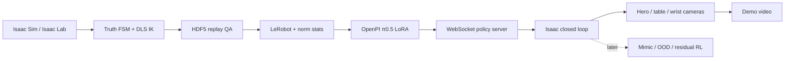

# VLA-TidyBench

VLA-TidyBench 是一个面向具身智能工程作品集的仿真项目：在 Isaac Sim / Isaac Lab 中使用 Franka Panda 完成抽屉整理任务，并打通自动示范采集、LeRobot 数据转换、OpenPI π0.5 LoRA、策略服务、闭环执行、多机位录制，以及 Mimic、OOD 和强化学习扩展接口。

目标任务：**Open the drawer → pick an object → place it in the drawer → close the drawer.**


[查看新场景三机位视频（scripted teacher，仅用于场景与构图预览）](docs/media/vla-tidybench-new-scene-preview.mp4)

[查看最终项目视频（包含真实 π0.5 闭环结果与四技能专家展示）](docs/media/vla-tidybench-final-project.mp4)

## 当前实测状态

核心工程链路已经实际运行：

- Isaac Sim 6.0.1、Isaac Lab 3.0 beta2、Franka Panda 和原始双层抽屉。
- 7D 相对末端动作 `[dx, dy, dz, dRx, dRy, dRz, gripper]`，由 DLS IK 执行。
- 真值状态机自动教师；策略数据只包含双 RGB、本体状态、语言和动作，不包含物体真值。
- OPEN / PICK / PLACE / CLOSE 四个原子技能的自动采集与物理回放入口。
- 8 条 OPEN 成功轨迹，共 1,092 帧；已转换为 LeRobot 并计算归一化统计。
- π0.5 LoRA 双 RTX 4090 FSDP 完成 500-step 短训；最终训练 loss 为 `0.0316`，Orbax checkpoint 恢复、离线推理和 WebSocket 闭环均通过。
- 推理输出为 `(16, 7)` action chunk；首次 JIT 约 17 秒，预热后约 95–100 ms。
- 展示场景使用 Isaac 自带 `Simple_Room` 和 YCB 香蕉、碗、杯子；模型输入相机与展示相机严格分离。

500-step checkpoint 的固定 seed 闭环试验执行了 240 个控制步，但抽屉关节仍为约 `0.0 m`，没有通过 `0.30 m` 成功阈值。也就是说，本仓库已经跑通训练和真实模型闭环，但当前少数据策略尚未学会稳定接触并拉开把手。仓库不会把 scripted-teacher 成功视频冒充 π0.5 成功结果。

边界声明：少量训练数据和短训用于验证完整工程链路，不代表论文级泛化能力。视频明确标注哪些片段来自真实 π0.5 闭环，哪些片段是 scripted teacher 的场景/技能展示。

## 技术路线



```text
GPU 0: Isaac Sim / cameras
GPU 1: OpenPI inference
GPU 0 + 1: short FSDP LoRA training
```

## 最小完整复现

所有命令在已经配置好的云服务器执行：

```bash
cd /home/ubuntu/mycode/vla-tidybench
make doctor
make test
```

### 1. 采集少量 OPEN 数据

```bash
SKILL=open NUM_DEMOS=8 MAX_ATTEMPTS=12 MAX_STEPS=360 SEED=300 \
DATASET_FILE=/home/ubuntu/data/vla-tidybench/raw/drawer_open_mvp.hdf5 \
./scripts/collect_scripted_drawer.sh --overwrite
```

### 2. 转换为 LeRobot 并计算统计量

```bash
./scripts/run_openpi.sh scripts/convert_stack_to_lerobot.py \
  --config configs/data/drawer_open_mvp.json \
  --data-root /home/ubuntu/data/vla-tidybench/raw --overwrite

./scripts/run_openpi.sh scripts/compute_drawer_norm_stats.py
```

### 3. π0.5 LoRA 短训

```bash
OPENPI_CUDA_VISIBLE_DEVICES=0,1 \
./scripts/run_openpi.sh scripts/train_drawer_pi05.py \
  --steps 500 --batch-size 2 --fsdp-devices 2 \
  --exp-name open_mvp --overwrite
```

本机实测稳定训练约 1.5–1.8 秒/step。训练只保存最终候选，以减少 8.8 GB checkpoint 的写盘开销。

### 4. 启动真实 π0.5 策略服务

```bash
OPENPI_CUDA_VISIBLE_DEVICES=1 \
./scripts/run_openpi.sh scripts/serve_drawer_policy.py \
  --checkpoint /ABS/PATH/TO/CHECKPOINT --port 8000
```

另开终端运行 Isaac 闭环：

```bash
./scripts/run_isaac.sh scripts/run_drawer_pi05_closed_loop.py \
  --device cuda:0 --enable_cameras --viz none \
  --host 127.0.0.1 --port 8000 \
  --max-steps 240 --execute-steps 4 --showcase \
  --output /home/ubuntu/data/vla-tidybench/eval/pi05_open_showcase.hdf5
```

抽屉关节只用于 success metric，不发送给 π0.5。策略输入只有 `table RGB + wrist RGB + q/qdot + prompt`。

### 5. 多机位视频

```bash
FFMPEG_BIN=$(./scripts/run_openpi.sh -c \
  'import imageio_ffmpeg; print(imageio_ffmpeg.get_ffmpeg_exe())') \
./scripts/run_openpi.sh scripts/render_pi05_showcase.py \
  /home/ubuntu/data/vla-tidybench/eval/pi05_open_showcase.hdf5 \
  artifacts/demo/vla-tidybench-pi05-open-showcase.mp4
```

视频包含 720p 远景 hero camera、桌面策略相机和腕部策略相机。远景相机、家具背景和装饰模型不进入策略观测。

## 四技能与扩展

四个 scripted 原子技能入口：

```bash
make drawer-open-smoke
make drawer-pick-smoke
make drawer-place-smoke
make drawer-close-smoke
make drawer-demo
```

- **Mimic**：官方 Franka stack Mimic smoke 已跑通；抽屉 Mimic 的自定义 subtask registration 仍为扩展 gate，配置保留在 `configs/mimic/`。
- **OOD**：`make ood-plan` 生成固定 ID / visual / geometry / physics 评测计划，本次预算内不运行大评测。
- **RL**：保留冻结 π0.5 + bounded residual SAC 接口；本次不进入 RL，避免把工程验证误写成 π0.5 原生 RL。

## 仓库内容

```text
configs/                 数据、仿真、Mimic、OOD、RL 配置
docs/                    动作规范、部署、里程碑与发布说明
policy_bridge/           WebSocket 协议 smoke server
scripts/                 采集、转换、训练、闭环与视频脚本
source/vla_tidybench/    可复用 Python 包
tests/                   契约和回归测试
results/metrics/         小型 manifest 与指标
```

原始数据、模型权重、云端凭据和缓存不进入 Git。提交前运行：

```bash
make test
make extension-smoke
make prepublish
```
