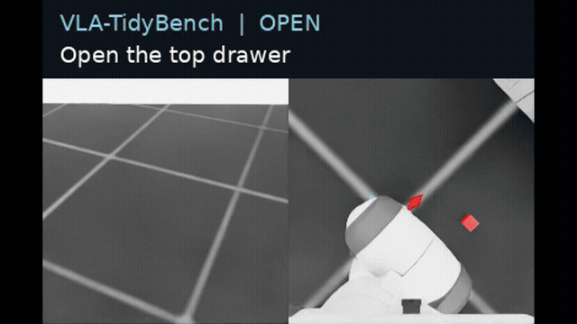
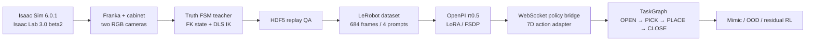

# VLA-TidyBench

VLA-TidyBench 是一个面向具身智能工程作品集的仿真项目：在 Isaac Sim / Isaac Lab 中使用 Franka Panda 完成抽屉操作，并打通自动示范采集、LeRobot 数据转换、OpenPI π0.5 LoRA、策略服务、TaskGraph、Mimic、OOD 评测和强化学习扩展接口。

> 目标任务：**Put the red object into the top drawer and close it.**



## 当前成果与边界

截至 2026-08-13，以下核心工程链已经实际运行：

- 自定义 Franka + 双层柜体 + 红色目标物场景；桌面和腕部两路 `200×200` RGB 相机。
- 统一 7D 相对末端动作：`[dx, dy, dz, dRx, dRy, dRz, gripper]`，由 Isaac Lab DLS IK 执行。
- “物体真值定位 + 状态机规划 + 正运动学读取 + DLS 逆运动学”自动教师。
- OPEN、PICK、PLACE、CLOSE 四个原子技能均完成成功采集及物理回放验证。
- 四个语言技能共 4 个 episode、684 帧、20 Hz，已转换为本地 LeRobot 数据集。
- π0.5 归一化统计、双 RTX 4090 FSDP LoRA 2-step 训练冒烟、checkpoint 恢复和一次离线推理均通过。
- OpenPI checkpoint 输出动作块形状为 `(16, 7)`；首次 JIT 推理约 `17.1 s`，目前只证明部署接口，不代表实时闭环性能。
- 已生成 40.2 秒双相机 scripted-teacher 技能演示视频。

以下部分被完整保留，但本次为节省云服务器费用没有执行长时间实验：

- **Drawer Mimic**：固定成功轨迹输入、自动标注/生成产物路径及 smoke 预算。正式大规模生成待后续执行。
- **OOD 大评测**：保留 ID、视觉 OOD、几何 OOD、物理 OOD 四类桶、固定种子和 manifest 生成器；当前仅生成 8 回合 smoke 计划，未声称成功率。
- **强化学习**：保留冻结 π0.5、仅修正 6D 末端动作的 bounded residual SAC 接口、奖励项、无特权 actor 约束和 LoRA 回退门；尚未进行长程 RL 训练。

连续的 OPEN→PICK→PLACE→CLOSE scripted TaskGraph 在 OPEN→PICK 的状态切换处仍会出现抓取失败，因此最终视频是四条独立、回放验证通过的原子技能展播，**不是**一次连续 VLA 策略成功，也不是 2-step checkpoint 的性能证明。

## 技术路线



Isaac 和 OpenPI 使用两个独立 Python 环境及进程，避免 PyTorch/Isaac 与 JAX 依赖冲突：

```text
GPU 0: Isaac Sim / Isaac Lab / cameras
GPU 1: OpenPI policy inference
GPU 0 + 1: short FSDP LoRA smoke training

Isaac worker  <-- WebSocket + msgpack -->  OpenPI policy server
```

部署策略仅接收双 RGB、关节本体状态和语言。物体位姿、抽屉关节和接触真值仅供 scripted teacher、成功判定、Mimic、RL reward/critic 和调试使用，不进入可部署 VLA actor。

## 快速复现

所有命令在已配置的云服务器执行：

```bash
cd /home/ubuntu/mycode/vla-tidybench
```

### 1. 环境与接口检查

```bash
make doctor
make test
make drawer-scene-smoke
make protocol-smoke
```

### 2. 自动采集与回放

运行四个原子技能采集：

```bash
make drawer-atomic-validate
```

单独采集或回放：

```bash
make drawer-open-smoke
make drawer-pick-smoke
make drawer-place-smoke
make drawer-close-smoke

make drawer-replay \
  SKILL=open \
  DATASET_FILE=/home/ubuntu/data/vla-tidybench/raw/drawer_open_smoke.hdf5
```

采集器读取 simulator truth 生成末端目标，但 HDF5 policy observation 只保存 `joint_pos`、`joint_vel`、`table_cam` 和 `wrist_cam`。human、teacher、Mimic、训练和部署必须保持同一 7D IK-relative 动作语义。

### 3. HDF5 → LeRobot → π0.5

```bash
make drawer-convert-openpi
make drawer-norm-stats

# 只验证链路；2 step 不代表策略已学会任务
STEPS=2 BATCH_SIZE=2 FSDP_DEVICES=2 \
  EXP_NAME=drawer-smoke make drawer-train

# 从 Orbax checkpoint 恢复并对一条真实观测执行推理
make drawer-policy-smoke
```

主要产物位于：

```text
/home/ubuntu/data/vla-tidybench/raw/
/home/ubuntu/data/vla-tidybench/cache/huggingface/lerobot/
/home/ubuntu/data/vla-tidybench/checkpoints/openpi-assets/
/home/ubuntu/data/vla-tidybench/checkpoints/openpi-runs/
```

### 4. Demo

```bash
make drawer-demo
```

输出：

```text
artifacts/demo/vla-tidybench-skill-suite.mp4
docs/media/demo-preview.gif
```

原始 HDF5、模型权重和 MP4 被 `.gitignore` 排除；MP4 应上传到私有 GitHub Release，而非提交到 Git 历史。

## 保留的进阶模块

### Isaac Lab Mimic

Drawer smoke 配置位于 `configs/mimic/drawer_smoke.json`。后续流程为：成功完整轨迹 → 子任务标注 → 10-trial smoke → replay QA → 逐步扩到 500–1000 条成功轨迹。当前自定义 drawer TaskGraph 需先解决 OPEN→PICK 连续状态，再启用大规模生成。

项目早期官方 Franka stack baseline 已实际完成 Mimic smoke：10 条在线成功轨迹来自 30 次生成尝试，严格物理回放通过 7/10。这也说明 contact-rich physics replay 不保证逐帧确定。

### OOD 大评测

```bash
make extension-smoke
make ood-plan
```

`configs/eval/drawer_ood_smoke.json` 固定四类评测桶；`scripts/plan_ood_eval.py` 生成不可重复种子的 rollout manifest。正式评测应使用冻结 checkpoint，分别报告每桶 success rate、95% Wilson CI、碰撞、峰值力、耗时、action jerk 和推理延迟；同 seed 策略差值使用 paired bootstrap，而不是把两组视作独立样本。

### 冻结 VLA 的残差强化学习

RL 主线不直接声称“用 SAC 微调了 π0.5”。公开 OpenPI π0.5 是 Flow-Matching 行为克隆策略，没有可直接用于标准 PPO/SAC 的 log-prob/value/replay 接口。本项目采用可落地的工程边界：

```text
a_exec = SafetyGuard(a_pi05 + beta * clip(delta_a))
```

- 冻结 π0.5 + LoRA；残差 actor 仅输出 6D 连续末端修正，不改离散夹爪通道。
- actor 只看可部署本体量、nominal action 和 chunk state；drawer joint/handle pose/contact truth 只给 asymmetric critic 与 reward。
- 首选 OPEN_DRAWER 单技能 Residual SAC；只有 paired validation 提升且碰撞、力和 jerk 不恶化时才接入 TaskGraph。
- 任一 gate 失败，默认回退到冻结的 LoRA 策略。

配置和可测试核心位于 `configs/rl/open_residual_sac.json` 与 `source/vla_tidybench/rl/`。

## 仓库结构

```text
configs/                 数据、仿真、Mimic、OOD、RL 配置
docs/                    动作规范、部署、里程碑和发布检查
policy_bridge/           独立 WebSocket 协议测试服务器
scripts/                 采集、回放、转换、训练、评测和视频入口
source/vla_tidybench/    可复用 Python 包
tests/                   依赖较轻的单元与契约测试
results/metrics/         小型、可版本化的 manifest/指标
artifacts/               不进入 Git 的视频与发布产物
```

## 诚实复现声明

本仓库证明的是完整工程链路和模块化设计，不声称：

- 2-step LoRA checkpoint 已学会抽屉任务；
- scripted teacher Demo 是 VLA 闭环结果；
- 连续长任务、Drawer Mimic 大规模生成、OOD 大评测或 RL 训练已经完成；
- 仿真结果可直接迁移到真实机器人。

发布前运行：

```bash
make test
make extension-smoke
make prepublish
```

项目开发期保持私有，暂不授予公共许可证。
