# VLA-TidyBench

Simulation-first, language-conditioned long-horizon manipulation with a Franka
Panda, Isaac Sim, Isaac Lab, π0.5 and failure-driven residual reinforcement
learning.

> Final task: **“Put the red mug into the top drawer and close it.”**

This repository is under active development. The official Franka baseline,
two-camera observation path and the isolated simulator-to-policy protocol are
validated. Drawer-task training, final evaluation and the demonstration video
will only be marked complete after their milestone gates pass; no result in
this README is a placeholder presented as an experiment.

## Project objective

VLA-TidyBench is an end-to-end portfolio project for embodied-AI engineering.
It covers task construction, human and synthetic data collection, π0.5
adaptation, closed-loop deployment, long-horizon task composition, targeted RL
post-training and reproducible ID/OOD evaluation—all in simulation, without
claiming sim-to-real performance.

The final scene uses a Franka Panda, a cabinet with two drawers and distractor
objects. A language command selects the target object and drawer. The robot
must open the drawer, grasp the object, place it inside and close the drawer.

## Technical route

```mermaid
flowchart LR
    A["Isaac Sim + Isaac Lab<br/>Franka / cabinet / two RGB cameras"]
    B["Human demonstrations<br/>7D task-space actions"]
    C["Replay QA + Isaac Lab Mimic"]
    D["LeRobot / openpi dataset"]
    E["π0.5 imitation fine-tuning"]
    F["WebSocket policy service<br/>receding-horizon control"]
    G["TaskGraph<br/>OPEN → PICK → PLACE → CLOSE"]
    H["Failure collection<br/>bounded residual RL"]
    I["Fixed-seed ID/OOD evaluation"]
    J["Demo + private release"]
    A --> B --> C --> D --> E --> F --> G --> H --> I --> J
```



The simulator and VLA run in separate processes and Python environments:

```text
GPU 0: Isaac Sim 6.0.1 + Isaac Lab + two RGB cameras
GPU 1: openpi π0.5 policy server / training

Isaac worker  <-- WebSocket/msgpack -->  openpi policy server
```

The canonical robot action is a physical 7D command:
`[dx, dy, dz, dRx, dRy, dRz, gripper]`, with translation in metres, rotation in
radians and a binary gripper command. Data conversion and deployment share one
action adapter. The nominal control rate is 20 Hz; an action chunk covers a
short horizon and is replanned after 2–4 executed steps.

RL does not replace imitation learning. Once the π0.5 baseline is frozen, a
small bounded residual policy targets one empirically identified contact-rich
failure mode. Simulator truth may be used by the reward and asymmetric critic,
but not by the deployable actor. The RL specialist is enabled in the TaskGraph
only if paired evaluation shows an improvement without violating collision,
force and action-smoothness gates.

## Status

| Milestone | Deliverable | Status |
| --- | --- | --- |
| M0 | Official Franka IK-relative and visuomotor baseline | Passed except human-data gate |
| M1 | Custom tabletop/bin task and dataset pipeline | Planned |
| M2 | Drawer scene and atomic skills | Planned |
| M3 | π0.5 dataset conversion and fine-tuning | Planned |
| M4 | Closed-loop policy service and TaskGraph | Planned |
| M5 | Failure-driven residual RL experiment | Planned |
| M6 | Locked ID/OOD evaluation, Demo and private release | Planned |

The detailed gates are in [docs/milestones.md](docs/milestones.md).

## Reproducible commands

### 1. Environment and protocol checks

Run these commands on the provisioned server:

```bash
cd /home/ubuntu/mycode/vla-tidybench
make doctor
make test
make sim-smoke
make sim-camera-smoke
make protocol-smoke
```

The Isaac process must run through `scripts/run_isaac.sh`, which activates the
preinstalled Python 3.12 environment and pins rendering to GPU 0. The openpi
process runs through `scripts/run_openpi.sh` in its separate Python 3.11/JAX
environment.

### 2. Human demonstration and Mimic smoke test

Start recording from the cloud desktop because keyboard teleoperation is
interactive:

```bash
cd /home/ubuntu/mycode/vla-tidybench
make record
```

After recording successful demonstrations:

```bash
make replay
make annotate
make mimic-smoke
```

Replay is a required data-quality gate. Joint-position demonstrations must not
be mixed with the IK-relative 7D task-space action contract.

### 3. Later-stage command contract

The following interfaces are reserved for later milestones and are not claimed
as implemented until their corresponding status changes to **Passed**:

```bash
make build-drawer-task       # validate reset, reward, success and cameras
make generate-dataset        # create accepted Mimic episodes
make convert-openpi          # HDF5 -> LeRobot/openpi, episode-level split
make train-pi05              # π0.5 imitation fine-tuning
make eval-pi05               # frozen-seed atomic and end-to-end evaluation
make collect-rl              # failures, near misses and bounded exploration
make train-residual-rl       # frozen-VLA residual actor/critic
make eval-final              # locked paired ID/OOD evaluation
make record-final-demo       # deterministic render plus run metadata
make package-demo INPUT=...  # H.264 MP4, preview GIF and SHA-256
make prepublish              # tracked-file and secret audit
```

Each command will be wired to a checked-in config before it is documented as
runnable. This prevents a README from getting ahead of the actual system.

## Evaluation protocol

The final report will compare the scripted teacher, base π0.5, fine-tuned π0.5
and π0.5 plus the gated RL specialist on the same episode seeds and action
adapter. Skill and checkpoint selection use a validation split; the locked
final test set is evaluated once after freezing the release candidate.

Reported metrics include end-to-end success, stage completion, time to
completion, collisions, peak force, action jerk and inference latency. ID,
visual OOD, geometric/physical OOD and perturbation recovery are reported
separately. Success rates include confidence intervals; paired policy deltas
use paired resampling rather than treating matched episodes as independent.

Final metrics: **pending locked evaluation**.

## Demo and release policy

The final video protocol is defined in
[docs/demo_protocol.md](docs/demo_protocol.md). The primary task segment is an
uninterrupted simulator rollout; editing may add labels, metrics and narration
but must not conceal policy interventions or splice several attempts into a
fake success.

The repository is intended to remain private during development. The
publication checklist in
[docs/private_release_checklist.md](docs/private_release_checklist.md) blocks
upload until tests, fixed-seed evaluation, secret scanning and artifact checks
pass. Raw data, model weights, server credentials, SSH keys and full-resolution
MP4 files are excluded from Git history. The final MP4 is attached to a private
GitHub Release; only a small preview GIF is tracked in the repository.

## Safety and scope

- The actor receives RGB, deployable proprioception, language, prior actions
  and policy state only; privileged simulator state is reserved for training
  rewards, critics, success labels and diagnostics.
- The VLA and simulator are isolated because their JAX and PyTorch/Isaac
  dependency stacks are incompatible.
- The frozen imitation-learning policy remains the fallback whenever the RL
  specialist fails its release gate.
- This is a simulation-first research and engineering demonstration. It does
  not claim real-robot deployment or sim-to-real validation.

## Repository layout

```text
configs/             versioned simulator and training configuration
docs/                action contract, deployment, milestones and release docs
policy_bridge/       standalone policy-server protocol smoke tests
scripts/             launch, collection, evaluation and packaging entrypoints
source/              reusable VLA-TidyBench Python package
tests/               dependency-light unit tests
results/metrics/     small, versioned evaluation summaries
docs/media/          small README preview assets only
```

No public license is granted while this repository remains private.
