# 数据流与模块输入输出参考

本文档以数据在 VLA-TidyBench 中的实际流动顺序为主线，说明各模块的输入、输出、字段、形状、坐标系和能力边界。目标是建立一套能够直接对应代码、数据文件和仿真结果的项目模型。

阅读每个模块时，都应回答五个问题：

1. 它接收什么输入？
2. 它产生什么输出？
3. 张量的字段名、形状和数据类型是什么？
4. 动作使用什么单位、坐标系和缩放规则？
5. 这些信息在真实部署时是否可获得？

## 1. 阅读目标

阅读本文后，应能够：

- 从 Isaac Lab 中的一帧桌面相机图像和一组 Franka 关节状态，一直追踪到 π0.5 的模型输入。
- 从 π0.5 输出的动作块，一直追踪到 Isaac Lab 中最终执行的机械臂动作。
- 区分仿真真值、可部署观测、监督标签和成功判据。
- 解释 HDF5、LeRobot、OpenPI Data Transform 和 Transformer 各自解决的问题。
- 推导项目中的物理频率、策略频率、动作缩放和关键张量形状。
- 解释为什么在线采集成功、严格物理回放成功和模型训练损失是三种不同指标。

## 2. 项目端到端数据流

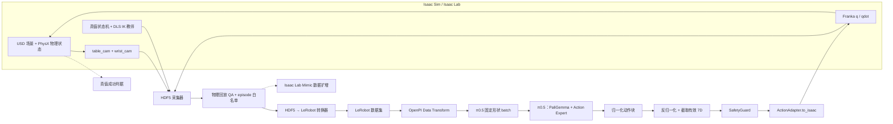

正向学习路径是：

```text
仿真环境 → 示范轨迹 → 数据集 → 模型 → 策略服务 → 机械臂执行
```

出现任务失败时，推荐反向排查：

```text
任务失败 → 实际执行动作 → 动作适配器 → 模型输出
→ 模型输入 → 转换后数据 → 原始示范
```

## 3. 核心名词

| 名词 | 在本项目中的含义 |
| --- | --- |
| VLA | Vision-Language-Action，视觉—语言—动作模型；根据图像、语言指令和机器人状态生成动作。 |
| Observation | 观测；策略在一个控制时刻可以读取的信息。 |
| State | 状态；环境的完整内部状态，可能包含策略无法直接获得的信息。 |
| Proprioception | 本体感知；机器人对自身状态的测量，本项目主要是关节位置 `q` 和关节速度 `qdot`。 |
| Privileged state | 特权状态；仿真中可以直接读取、但真实部署时通常不可直接获得的真值，例如药瓶精确位姿和抽屉关节位置。 |
| Action | 动作；策略或教师控制器发送的命令。本项目统一动作是 7 维。 |
| Episode | 回合/轨迹；从环境 reset 到成功、失败或超时的一段完整时序数据。 |
| Policy | 策略；把观测映射为单步动作或未来动作块的函数。 |
| Transform | 数据变换；重命名、缩放、分块、补零、掩码和归一化等预处理操作。 |
| Transformer | 基于注意力机制的神经网络架构；它不是数据转换器。 |
| Mask | 掩码；说明某个补齐后的输入槽是否真实有效。 |
| Contract | 模块契约；模块之间对字段名、形状、类型、单位、坐标系和语义的固定约定。 |

## 4. 模块输入输出总表

| 模块 | 输入 | 输出 | 必须保持的契约 |
| --- | --- | --- | --- |
| Isaac Sim / PhysX | 当前物理状态、Isaac 原始动作 | 下一时刻物理状态 | 物理步长 `0.01 s`，即 100 Hz。 |
| Isaac Lab 任务 | 场景、传感器和任务配置 | 策略观测、reset、成功信号 | `decimation=5`，策略频率为 20 Hz。 |
| `table_cam` | 渲染场景 | `uint8 (200,200,3)` RGB | 可部署模型输入。 |
| `wrist_cam` | 腕部视角 | `uint8 (200,200,3)` RGB | 可部署模型输入。 |
| `hero_cam` | 展示机位 | RGB 视频帧 | 只用于视频，不输入 π0.5。 |
| 真值 FSM 教师 | 物体/抽屉真值、FK 末端位姿、当前阶段 | 7D Isaac 原始动作 | 特权真值只能用于生成标签、奖励和成功判断。 |
| HDF5 采集器 | 观测、动作、仿真状态 | 按 episode 组织的 HDF5 | 保留原始数据和物理回放信息。 |
| `ActionAdapter.from_isaac` | `(T,7)` Isaac 原始动作 | `(T,7)` 规范物理动作 | 前 6 维乘内部 IK 缩放 `0.5`。 |
| HDF5 → LeRobot | 通过 QA 的 episode、prompt 清单 | 标准化的机器人帧和元数据 | 可部署字段中不得混入特权状态。 |
| OpenPI Data Transform | LeRobot 帧/episode | 固定形状、归一化的 π0.5 batch | 完成 resize、chunk、pad、mask、tokenize 和 normalize。 |
| π0.5 | 图像、图像掩码、状态、语言 token、带噪动作和 flow time | 动作流预测与未来动作块 | 模型动作宽度 32，Franka 只有前 7 维有效。 |
| SafetyGuard | 规范物理 7D 动作 | 有界的规范物理动作 | 拒绝 NaN/Inf，并限制平移、旋转和残差幅度。 |
| `ActionAdapter.to_isaac` | 规范物理 7D 动作 | Isaac 原始 7D 动作 | 前 6 维除以 `0.5`，避免隐藏的二次缩放。 |

## 5. 系统边界与总体架构

### 5.1 Isaac Sim、Isaac Lab 与 OpenPI

- **Isaac Sim** 是仿真器，负责 USD 场景、PhysX 物理、机器人关节和 RTX 相机。
- **Isaac Lab** 是建立在 Isaac Sim 上的机器人学习框架，负责任务、观测、动作、reset、成功判据和数据记录接口。
- **OpenPI** 是配置、训练和部署 π0.5 的模型软件栈。
- **Policy Server** 是加载 π0.5 权重并执行推理的服务端进程。
- **Policy Client** 是运行在 Isaac 侧的客户端；它发送观测并执行返回的动作。

项目将 Isaac 与 OpenPI 放在两个独立 Python 环境中：

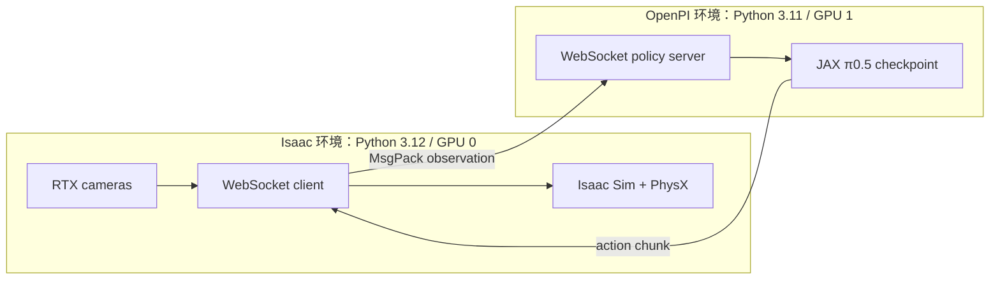

这样做是为了隔离 Isaac/PyTorch 与 OpenPI/JAX 的 Python、NumPy、CUDA 依赖，避免把两个环境强行安装在一起。

### 5.2 检查要点

- 能说明 Isaac Sim、Isaac Lab、OpenPI、Policy Client 和 Policy Server 的职责。
- 能画出“Isaac 生成观测，OpenPI 返回动作”的闭环。
- 能解释为什么两个 GPU 的主要价值是隔离仿真和模型服务，而不是自动合并显存。

对应文件：[`environment.md`](environment.md)、[`deployment.md`](deployment.md)、[`../Makefile`](../Makefile)。

## 6. 场景、物理与相机观测

### 6.1 场景基础

- **USD（Universal Scene Description）**：保存场景层级、几何体、位姿、材质和物理属性的场景格式。
- **Prim**：USD 场景树中的节点。
- **Rigid Body**：不可变形但能够运动和碰撞的刚体，例如药瓶。
- **Articulation**：由关节连接的刚体集合，例如 Franka 和抽屉柜。
- **Collision Shape**：PhysX 用于接触计算的几何体。只有视觉模型、没有碰撞体的物体无法被正确抓取。
- **Mass / Friction**：质量与摩擦系数，决定惯性、抓取稳定性和滑动。

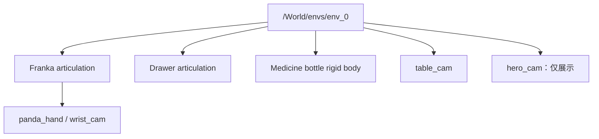

### 6.2 时间频率

```text
sim.dt = 0.01 s
物理频率 = 1 / 0.01 = 100 Hz
decimation = 5
策略周期 = 0.01 × 5 = 0.05 s
策略频率 = 1 / 0.05 = 20 Hz
```

因此，一个策略动作会保持 5 个物理步。

### 6.3 相机契约

| 相机 | 输出 | 使用者 |
| --- | --- | --- |
| `table_cam` | `uint8 (200,200,3)` RGB | 数据集和 π0.5 |
| `wrist_cam` | `uint8 (200,200,3)` RGB | 数据集和 π0.5 |
| `hero_cam` | 展示帧 | 多机位演示视频，不参与策略推理 |

### 6.4 检查要点

- 能从 USD 场景树中找到机器人、抽屉、目标物体和相机。
- 能推导 100 Hz 物理频率和 20 Hz 策略频率。
- 能解释为何展示相机不能直接当作训练相机。

对应文件：[`../source/vla_tidybench/isaac/drawer_env_cfg.py`](../source/vla_tidybench/isaac/drawer_env_cfg.py)、[`../assets/medicine_bottle.usda`](../assets/medicine_bottle.usda)。

## 7. 运动学与统一动作

### 7.1 坐标系

- **World frame**：仿真世界的全局坐标系。
- **Robot base frame**：固定在 Franka 底座的坐标系；本项目的规范平移和旋转增量使用该坐标系。
- **End-effector frame**：固定在 `panda_hand` 的末端坐标系。
- **Tool offset**：手掌坐标系到实际控制点的固定变换；项目使用 `0.107 m` 的 z 方向偏移。

### 7.2 FK、IK、Jacobian 与 DLS

- **FK（Forward Kinematics，正运动学）**：输入关节位置 `q`，输出末端执行器位姿。
- **IK（Inverse Kinematics，逆运动学）**：输入目标末端位姿或位姿增量，输出关节目标。
- **Jacobian（雅可比矩阵）**：在局部线性范围内连接关节变化与末端变化：

```math
\Delta x = J(q)\Delta q
```

- **DLS（Damped Least Squares，阻尼最小二乘）**：在接近奇异位形时通过阻尼项抑制异常大的关节动作：

```math
\Delta q = J^T(JJ^T + \lambda^2 I)^{-1}\Delta x
```

### 7.3 统一 7D 动作

```text
[dx, dy, dz, dRx, dRy, dRz, gripper]
```

- 平移前三维：每个策略步的米制位移增量。
- 旋转三维：轴角旋转向量，单位为弧度；不是欧拉角。
- 夹爪一维：正值表示张开，负值表示闭合。
- Isaac Lab 3 的四元数顺序是 XYZW。

动作缩放往返关系：

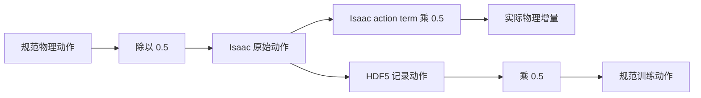

例如期望物理位移 `dx=0.02 m`，适配器发送 Isaac 原始动作 `dx=0.04`；Isaac 内部再乘 `0.5`，最终执行 `0.02 m`。

### 7.4 检查要点

- 能分别说出 FK 和 IK 的输入输出。
- 能解释 Jacobian 和 DLS 的作用。
- 能写出 7D 动作每一维的含义。
- 能推导 `0.02 m → 0.04 raw → 0.02 m executed`。

对应文件：[`action_spec.md`](action_spec.md)、[`../source/vla_tidybench/policy_bridge/action_adapter.py`](../source/vla_tidybench/policy_bridge/action_adapter.py)、[`../source/vla_tidybench/policy_bridge/safety_guard.py`](../source/vla_tidybench/policy_bridge/safety_guard.py)。

## 8. 可部署观测与特权真值

π0.5 的可部署观测包括：

```text
table RGB
wrist RGB
9D joint position
9D joint velocity
language prompt
```

18 维机器人状态属于本体感知。项目不会把药瓶精确位姿、抽屉关节真值和接触真值直接输入 π0.5。

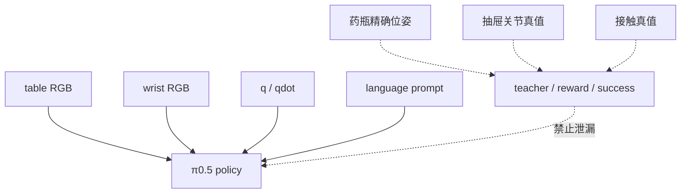

仿真真值可以用于自动采集、训练奖励和成功判定，但不能偷偷输入部署策略，否则模型依赖了真实机器人上不存在的传感器。

### 8.1 π0.5 的三个图像槽

| OpenPI 图像槽 | 项目来源 | Mask |
| --- | --- | ---: |
| `base_0_rgb` | `table_cam` | `True` |
| `left_wrist_0_rgb` | Franka `wrist_cam` | `True` |
| `right_wrist_0_rgb` | 全零补位图像 | `False` |

第三个槽是为了兼容双臂/双腕相机数据，不是 `hero_cam`。本项目只有一台腕相机，因此补零并用 `False` 掩码告诉模型该槽无效。

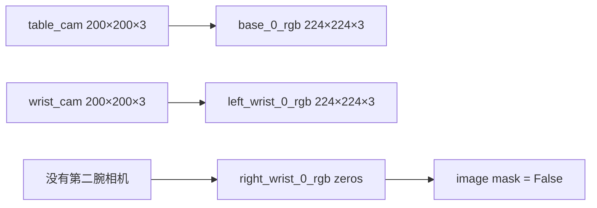

### 8.2 检查要点

- 能列出 π0.5 的全部可部署输入。
- 能列出不得传给 actor 的特权字段。
- 能正确映射三个图像槽，并解释第三槽的 `False` mask。

对应文件：[`../source/vla_tidybench/policy_bridge/observation_adapter.py`](../source/vla_tidybench/policy_bridge/observation_adapter.py)、[`../tests/test_observation_adapter.py`](../tests/test_observation_adapter.py)。

## 9. 真值教师、FSM 与 TaskGraph

脚本教师不是训练出的模型。它读取仿真真值，选择有限状态机阶段，生成任务空间 waypoint，再使用 FK 读取当前末端位姿并通过 DLS IK 产生专家动作。

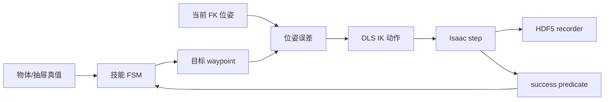

- **FSM（Finite State Machine，有限状态机）**：管理单个技能内部的阶段。例如 PICK 中的靠近、下降、闭爪和抬升。
- **TaskGraph（任务图）**：管理完整技能之间的顺序与条件，例如 `OPEN → PICK → PLACE → CLOSE`。
- **Waypoint（路径点）**：末端执行器希望到达的中间目标位姿。
- **Success Predicate（成功判据）**：独立于训练损失的物理布尔条件。正式评估使用版本化的
  `drawer_skill_v2_relative_stable`：PICK 相对初始高度抬升并保持闭爪，PLACE 入柜并释放，CLOSE
  在关门时还要确认药瓶留在抽屉坐标系内；判据必须连续保持 5 个 20 Hz 控制步。

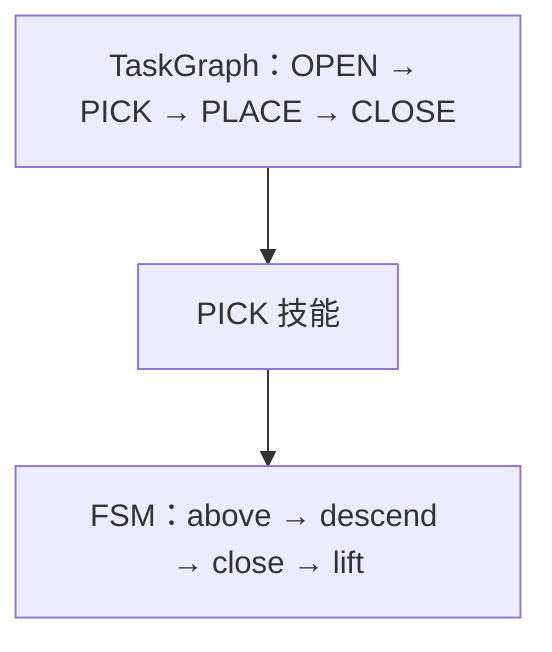

### 9.1 检查要点

- 能区分“一个技能内部的 FSM”和“四技能之间的 TaskGraph”。
- 能说明真值教师为什么能自动生成数据，也能说明它为什么不是最终部署策略。
- 能解释低 imitation loss 不等于物理任务成功。

对应文件：[`../scripts/collect_scripted_drawer.py`](../scripts/collect_scripted_drawer.py)、[`data_collection.md`](data_collection.md)、[`../source/vla_tidybench/task_graph.py`](../source/vla_tidybench/task_graph.py)、[`../source/vla_tidybench/task_metrics.py`](../source/vla_tidybench/task_metrics.py)。

## 10. HDF5、物理回放与 Mimic

### 10.1 HDF5 是什么

HDF5 是通用的层级二进制容器，可以保存数组和元数据，但它本身并不理解机器人任务语义。

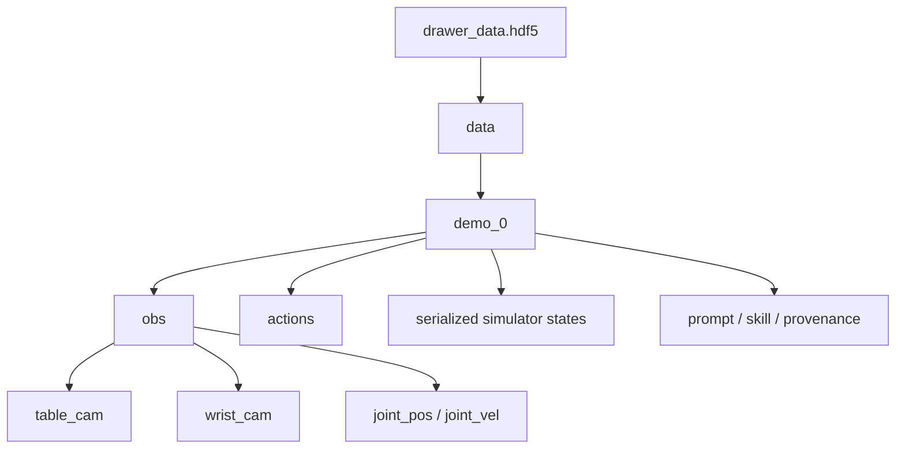

序列化仿真状态用于回放和调试，不属于 π0.5 的可部署输入。

### 10.2 Replay QA

物理回放会把已记录动作重新发送给仿真器，再次检查成功判据。接触丰富的 GPU 物理仿真不保证逐位确定性；微小的 reset、接触顺序和浮点误差都可能使临界成功轨迹在回放时失败。

因此必须分别记录：

```text
采集当时在线成功率
之后严格物理回放成功率
模型闭环推理成功率
```

项目中的 Stack Mimic smoke 在线生成 10 条成功轨迹，其中 7 条通过后续严格回放。正确处理方式是保留 10 条原始数据，同时建立 7 条 replay-validated allowlist，而不是修改原始结果。

### 10.3 Isaac Lab Mimic

Mimic 会标注示范中的子任务，将任务空间轨迹变换到新的物体位姿，在仿真中执行候选轨迹，并只导出满足在线成功判据的结果。

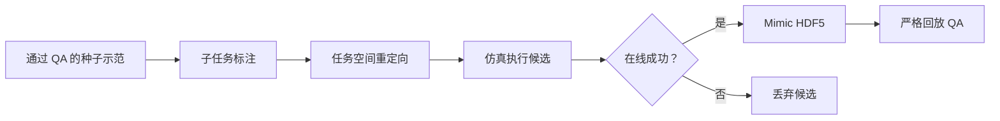

仓库中的抽屉 Mimic JSON 是扩展接口和 smoke 配置，不能描述成已经完成的大规模抽屉数据扩增实验。

### 10.4 检查要点

- 能画出一个 HDF5 episode 的基本层级。
- 能说明为何 raw 数据、成功白名单和转换后数据都要分别保存。
- 能解释 10/10 在线成功与 7/10 严格回放并不矛盾。
- 能说明 Mimic 依赖任务空间动作和物理成功过滤。

对应文件：[`../source/vla_tidybench/data/isaac_hdf5.py`](../source/vla_tidybench/data/isaac_hdf5.py)、[`../configs/mimic/drawer_smoke.json`](../configs/mimic/drawer_smoke.json)、[`../tests/test_isaac_hdf5_conversion.py`](../tests/test_isaac_hdf5_conversion.py)。

## 11. LeRobot 与 OpenPI Data Transform

### 11.1 LeRobot 是一种数据结构吗

更准确地说，**LeRobot 是一个机器人学习生态和标准化数据集接口，不只是单一数据结构**。在本项目中，它负责统一 episode、frame、图像、机器人状态、动作、时间戳、帧率、语言任务和元数据的语义。

| HDF5 | LeRobot 数据集 |
| --- | --- |
| 通用二进制容器 | 机器人数据 schema 与访问接口 |
| 层级由本项目自行定义 | episode/frame/task 语义更标准化 |
| 可保存完整仿真状态用于回放 | 面向训练暴露可部署观测与标签 |
| 主要负责原始采集和审计 | 主要负责模型训练、读取与共享 |

因此，可以说“LeRobot 定义了一套数据组织结构”，但不能把整个 LeRobot 简化成“一种文件格式”。

### 11.2 OpenPI Data Transform 是 Transformer 吗

不是。

- **OpenPI Data Transform** 是数据预处理流程：字段映射、图像 resize、时间动作分块、维度补零、掩码生成、语言 tokenize 和数值归一化。
- **Transformer** 是模型内部基于注意力机制的神经网络架构，π0.5 的 PaliGemma 和 Action Expert 使用了 Transformer 组件。

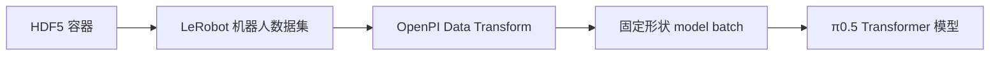

### 11.3 动作张量的完整变化

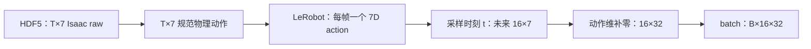

具体过程：

1. 采集器保存 `T` 个 7D Isaac 原始动作。
2. `ActionAdapter.from_isaac_batch` 将前 6 维乘 `0.5`，还原成规范物理单位。
3. 转换器为每个 LeRobot frame 写入一个 7D 规范动作。
4. OpenPI 从采样时刻 `t` 取得未来 16 步动作，形成 `(16,7)`。
5. 每步动作从 7 维补零到模型固定宽度 32，形成 `(16,32)`。
6. DataLoader 将 `B` 个样本组成 `(B,16,32)` batch。

状态与图像变化：

```text
Franka state：9D q + 9D qdot = 18D
OpenPI state：18 个有效值 + 14 个 padding 值 = 32D

Isaac 图像：200×200×3 uint8
OpenPI 图像槽：224×224×3
```

### 11.4 归一化统计

归一化把米、弧度、关节角等量纲不同的数值映射到适合模型学习的范围。部署时必须使用训练时同一份统计量，并在执行前反归一化。


错误的 normalization 文件通常不会触发 shape error，而是静默地产生错误的动作幅度，因此比明显报错更危险。

### 11.5 检查要点

- 能准确回答“LeRobot 不只是一个数据结构，而是机器人数据生态与标准接口”。
- 能准确回答“OpenPI Data Transform 是预处理，不是 Transformer”。
- 能从 `(T,7)` 推导到 `(B,16,32)`。
- 能解释为什么训练和部署必须共享同一份 normalization statistics。

对应文件：[`../scripts/convert_stack_to_lerobot.py`](../scripts/convert_stack_to_lerobot.py)、[`../scripts/compute_drawer_norm_stats.py`](../scripts/compute_drawer_norm_stats.py)、[`../configs/data/drawer_four_skill_mvp.json`](../configs/data/drawer_four_skill_mvp.json)、[`openpi_training.md`](openpi_training.md)。

## 12. 字段与形状总览

| 阶段 | 图像 | 状态 | 动作 | 语言 |
| --- | --- | --- | --- | --- |
| Isaac observation | table/wrist `200×200×3` | `q(9)+qdot(9)=18` | 接收 raw 7D | 任务字符串 |
| HDF5 episode | 每相机 `(T,200,200,3)` | 转换后 `(T,18)` | `(T,7)` Isaac raw | episode attribute |
| LeRobot frame | `image`、`wrist_image` | 18D 可部署状态 | 规范物理 7D | task/prompt 字段 |
| OpenPI transform | 三个带 mask 的 `224×224×3` 槽 | 补零到 32D | 分块并补零为 `16×32` | token IDs + mask |
| π0.5 batch | 每槽 `(B,224,224,3)` | `(B,32)` | target `(B,16,32)` | token IDs + masks |
| 部署输出 | 当前观测不变 | 当前 18D 状态 | 反归一化后的有效 `16×7` | 当前原子技能 prompt |

## 13. 常见混淆

1. **LeRobot 不只是另一种 HDF5 布局。** 它提供机器人 episode 语义、数据访问接口和训练生态。
2. **OpenPI Data Transform 不是 Transformer 层。** 前者整理数据，后者属于神经网络。
3. **第三个图像槽不是 `hero_cam`。** 它是缺失第二腕相机时的 masked padding。
4. **低训练损失不等于物理成功。** 平均动作误差很小时，夹爪仍可能偏离把手一厘米而失败。
5. **在线成功不等于严格回放成功。** 接触仿真会因微小误差产生轨迹分叉。
6. **教师可以使用特权真值，部署 actor 不可以。** 真值用于标签、奖励和评测，不是模型捷径。
7. **动作缩放属于核心数据契约。** 丢失 `0.5` 往返会让训练标签和部署动作表示不同物理运动。
8. **最终药瓶长视频是 π0.5-assisted rollout。** π0.5 在线参与推理，但接触安全轨迹主要由 DLS recovery 提供，不能描述成纯 π0.5 自主成功。

## 14. 理解检查清单

- [ ] 能手绘从观测到动作执行的完整闭环。
- [ ] 能解释 Isaac Sim 与 Isaac Lab 的区别。
- [ ] 能推导 100 Hz 物理频率与 20 Hz 策略频率。
- [ ] 能列出 π0.5 的可部署观测和被排除的特权字段。
- [ ] 能说明 FK、IK、Jacobian 和 DLS 的输入输出关系。
- [ ] 能推导物理 `0.02 m` 动作为什么对应 Isaac raw `0.04`。
- [ ] 能解释 FSM 与 TaskGraph 的区别。
- [ ] 能解释 success predicate 与 model loss 为什么必须分开。
- [ ] 能解释 10/10 Mimic 在线成功与 7/10 严格回放。
- [ ] 能解释 HDF5 与 LeRobot 的差异。
- [ ] 能解释 OpenPI Data Transform 与 Transformer 的差异。
- [ ] 能把 `(T,7)` Isaac 动作追踪到 `(B,16,32)` π0.5 target batch。
- [ ] 能把 `table_cam`、`wrist_cam` 映射到三个 OpenPI 图像槽，并解释第三槽的 `False` mask。
- [ ] 能说明最终连续长 Demo 为什么是 π0.5-assisted，而不是纯 π0.5。

## 15. 推荐代码阅读顺序

```text
source/vla_tidybench/isaac/drawer_env_cfg.py
→ source/vla_tidybench/policy_bridge/observation_adapter.py
→ source/vla_tidybench/policy_bridge/action_adapter.py
→ source/vla_tidybench/policy_bridge/safety_guard.py
→ scripts/collect_scripted_drawer.py
→ source/vla_tidybench/data/isaac_hdf5.py
→ scripts/convert_stack_to_lerobot.py
→ source/vla_tidybench/openpi/stack_config.py
→ scripts/smoke_openpi_batch.py
```

这个顺序与数据实际流动方向一致。先掌握观测和动作契约，再阅读训练与部署代码，会比直接从模型训练脚本入手更容易定位问题。
