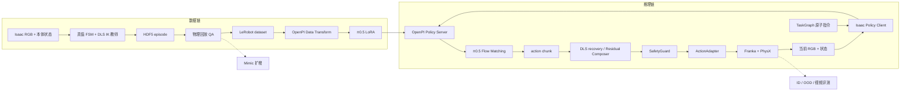
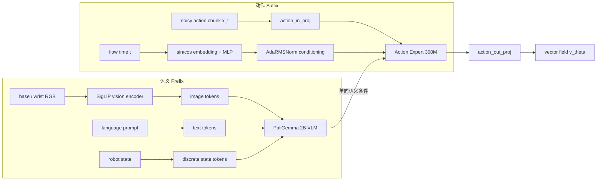
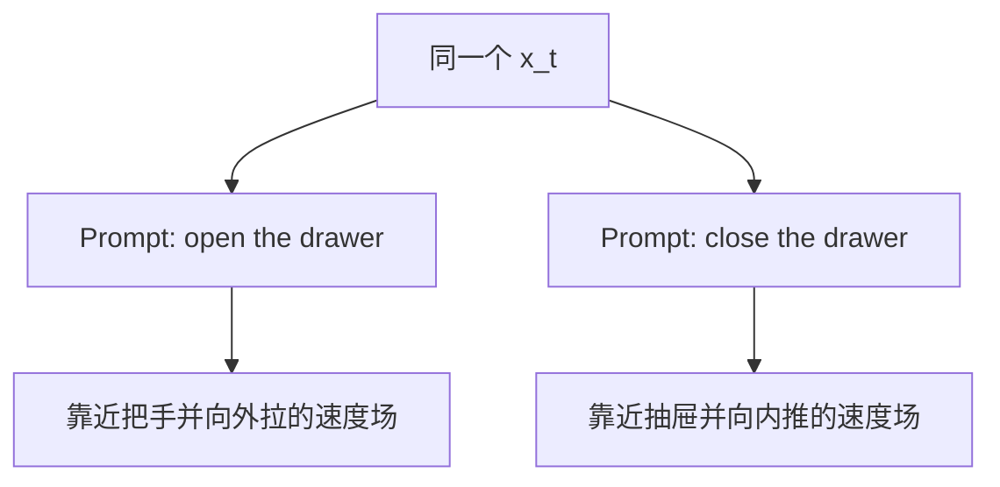
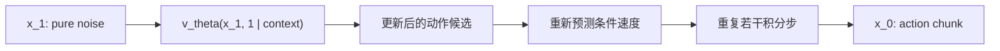
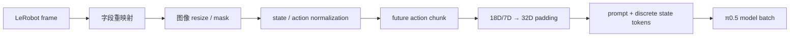
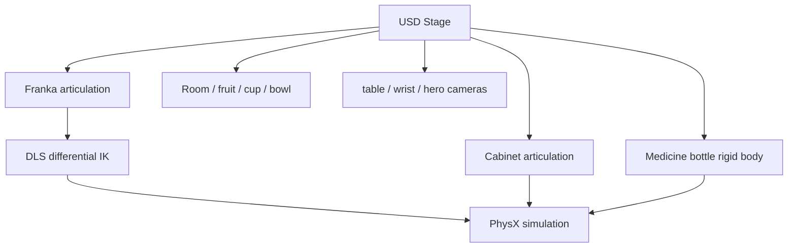
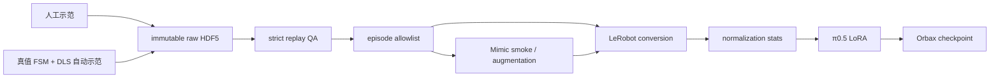
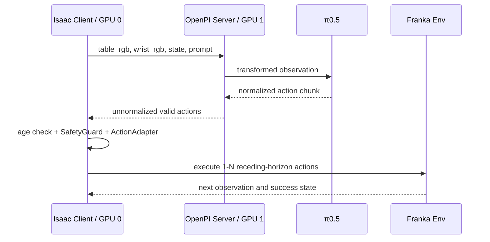
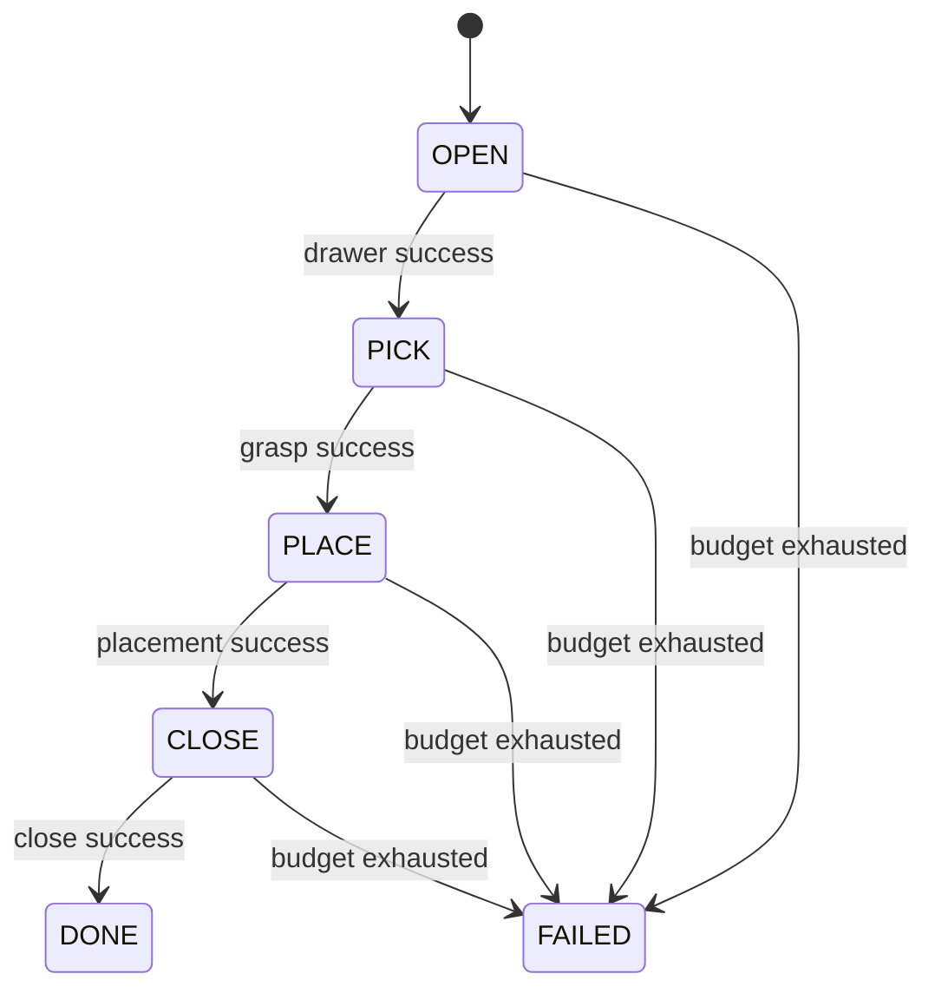
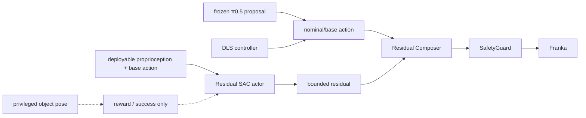

# π0.5 模型架构与项目技术框架

本文档集中说明 VLA-TidyBench 中的模型架构、训练机制、推理过程和工程框架。内容分为两条主线：

- **模型主线**：视觉和语言如何形成语义条件，Action Expert 如何通过 Flow Matching 生成 action chunk。
- **工程主线**：Isaac Sim、Isaac Lab、HDF5、LeRobot、OpenPI、策略桥、TaskGraph、Mimic、OOD 与残差强化学习如何组成完整系统。

论文中的完整 π0.5、公开 OpenPI 实现和本项目实际部署能力会分别描述，避免把论文能力、开源代码能力和项目演示结果混为一谈。

## 1. 系统总览



系统遵循三个基本约束：

1. 训练转换和部署执行共享同一套观测、动作和归一化契约。
2. 物体位姿、接触状态和抽屉关节等仿真真值只能用于教师、奖励和评测，不能泄漏给部署 actor。
3. 每个演示都必须标明是纯模型、模型辅助、脚本教师还是残差强化学习结果。

## 2. π0.5 的任务定义

VLA（Vision-Language-Action）策略接收当前观测与语言目标，输出未来一段动作：

```math
\pi_\theta(a_{t:t+H}\mid o_t,l)
```

其中：

- `o_t`：当前多相机图像和机器人本体状态。
- `l`：总体任务或当前原子技能的语言指令。
- `a_{t:t+H}`：从当前时刻开始的 action chunk。
- `H`：动作预测范围。

π0.5 论文中的完整层级策略还会生成高层子任务 `l_hat`：

```math
\pi_\theta(a_{t:t+H},\hat l\mid o_t,l)
=
\pi_\theta(a_{t:t+H}\mid o_t,\hat l)
\pi_\theta(\hat l\mid o_t,l)
```

高层部分回答“当前应该完成哪个子任务”，低层部分回答“机械臂接下来应该如何运动”。论文架构见 [π0.5 paper](https://www.physicalintelligence.company/download/pi05.pdf)。

## 3. 论文模型、公开实现与项目实现

| 层次 | 高层子任务 | 低层动作 | 本项目中的角色 |
| --- | --- | --- | --- |
| π0.5 论文 | 模型根据总体任务和观测生成文本子任务 | Action Expert 根据观测与子任务生成连续动作 | 理论参考架构 |
| 公开 OpenPI π0.5 | 当前仓库公开支持 Flow Matching 动作头；未提供完整论文高层文本生成链 | 支持 Flow Matching 训练与推理 | LoRA 和策略服务基础 |
| VLA-TidyBench | 确定性 `TaskGraph` 提供 OPEN/PICK/PLACE/CLOSE 原子 prompt | π0.5 在线产生 action proposal；DLS 提供接触恢复 | 可审计的工程实现 |

公开 OpenPI README 明确说明，π0.5 当前公开支持的是 Flow Matching head 的训练与推理：[Physical-Intelligence/openpi](https://github.com/Physical-Intelligence/openpi)。因此，本项目不会把外部 TaskGraph 描述成 π0.5 自己生成的高层文本计划。

## 4. π0.5 模型内部结构

π0.5 由一个较大的视觉语言主干和一个较小的动作专家组成：



### 4.1 PaliGemma VLM

PaliGemma 主干负责将视觉、语言和机器人状态组织成语义 Prefix：

- **SigLIP** 将每路图像转换成视觉 token。
- **语言 tokenizer** 将 prompt 转换成离散 token。
- π0.5 将本体状态作为离散状态输入并放入 Prefix；外部数据接口仍保留固定宽度的 `state` 字段。
- PaliGemma 对这些 token 进行联合建模，形成当前场景的语义上下文。

在本项目中，语义条件通常表示：

```text
看到了什么物体和家具
目标技能是 OPEN、PICK、PLACE 还是 CLOSE
机械臂当前处于什么本体状态
```

### 4.2 Action Expert

Action Expert 是专门生成连续机器人动作的小型 Transformer。它接收：

```text
PaliGemma 语义 Prefix
当前带噪 action chunk x_t
Flow Matching 时间 t
```

输出不是最终动作，而是当前位置的条件速度场：

```math
v_\theta(x_t,t\mid o,l)
```

带噪动作先通过 `action_in_proj` 投影到 Action Expert 的隐藏维度；动作隐藏状态最后通过 `action_out_proj` 投影回动作空间。公开实现可参考 [OpenPI `pi0.py`](https://github.com/Physical-Intelligence/openpi/blob/main/src/openpi/models/pi0.py)。

### 4.3 语义如何影响动作生成

语义不会直接修改噪声数值。Action Expert 的动作 token 通过 Attention 读取图像、语言和状态 Prefix 的 Key/Value：

```math
h_a=
\operatorname{Attention}
(Q_{action},K_{semantic},V_{semantic})
```

再由动作输出层得到速度：

```math
v_\theta=W_{out}h_a
```

因此，同一个随机动作在不同场景或不同 prompt 下会得到不同速度方向：



注意力掩码让信息主要从 VLM Prefix 单向流向 Action Expert，VLM 表示不需要在每个去噪步重新计算。推理服务先缓存 Prefix 的 KV，再反复更新动作 Suffix。

### 4.4 时间条件与 AdaRMSNorm

时间 `t` 表示当前动作块的噪声程度：

- `t` 接近 1：动作接近纯噪声，需要建立整体运动结构。
- `t` 接近 0：动作接近最终结果，需要精细修正。

π0.5 对时间进行正弦位置编码和 MLP 投影，再通过 AdaRMSNorm 调制 Action Expert 的层归一化。这样，相同动作候选在不同生成阶段会获得不同的处理方式。OpenPI 配置中的 π0.5 差异说明见 [`pi0_config.py`](https://github.com/Physical-Intelligence/openpi/blob/main/src/openpi/models/pi0_config.py)。

## 5. Flow Matching 动作生成

### 5.1 训练目标

设专家动作块为 `a`，高斯噪声为：

```math
\epsilon\sim\mathcal N(0,I)
```

OpenPI 使用 `t=0` 为真实动作、`t=1` 为纯噪声的约定：

```math
x_t=(1-t)a+t\epsilon
```

这条直线路径的目标速度为：

```math
u_t=\epsilon-a
```

模型训练目标为：

```math
\mathcal L=
\left\|v_\theta(x_t,t\mid o,l)-u_t\right\|^2
```

训练数据提供真实动作 `a`，程序随机生成 `epsilon` 和 `t`。Action Expert 学习的是“在当前语义条件下，带噪动作应该沿什么方向移动”，不是简单记忆一条确定动作。

### 5.2 推理过程

推理时没有真实动作，直接从纯高斯噪声开始：

```math
x_1\sim\mathcal N(0,I)
```

随后从 `t=1` 向 `t=0` 进行数值积分：

```math
x_{t+\Delta t}=x_t+\Delta t\,v_\theta(x_t,t\mid o,l),
\qquad \Delta t<0
```



“反向去噪”可以作为直观说法，但更准确的表述是：

> 从噪声分布出发，沿学习到的条件向量场求解常微分方程，将噪声运输到动作分布。

### 5.3 Action Chunk

Action chunk 是一次生成的未来动作序列，而不是单步动作。本项目配置为：

```text
action_horizon = 16
action_dim = 32
model output = (B, 16, 32)
Franka valid action = (B, 16, 7)
```

其中 7 个有效维度为：

```text
[dx, dy, dz, dRx, dRy, dRz, gripper]
```

其余维度是为了兼容通用机器人模型宽度而补零。部署端不会把 32 维直接发送给 Franka。

## 6. 输入编码与数据契约

### 6.1 三个图像槽

公开 OpenPI 模型接口固定包含三个图像槽：

| OpenPI 字段 | VLA-TidyBench 来源 | 是否有效 |
| --- | --- | ---: |
| `base_0_rgb` | `table_cam` | `True` |
| `left_wrist_0_rgb` | `wrist_cam` | `True` |
| `right_wrist_0_rgb` | 全零补位图像 | `False` |

`hero_cam` 只负责视频展示，不属于模型输入。OpenPI 的固定图像字段和 224×224 分辨率定义见 [model interface](https://github.com/Physical-Intelligence/openpi/blob/main/src/openpi/models/model.py)。

### 6.2 状态与语言

项目采集的机器人状态为：

```text
9D joint position + 9D joint velocity = 18D
```

OpenPI 外部批次将其补齐到 32 维。π0.5 模型专用转换会把状态编码到离散 Prefix 输入中，而不是像 π0 那样在动作 Suffix 中加入独立连续 state token。

语言使用原子技能 prompt：

```text
open the top drawer
pick up the medicine bottle
put the medicine bottle into the top drawer
close the top drawer
```

### 6.3 Data Transform 与 Transformer



- **Data Transform**：数据预处理流程。
- **Transformer**：PaliGemma 与 Action Expert 内部的神经网络架构。

两者名称相近，但功能完全不同。

## 7. 项目采用的技术框架

| 层级 | 框架/组件 | 项目职责 |
| --- | --- | --- |
| 场景与渲染 | Isaac Sim 6.0.1、USD、RTX | 加载机器人和资产，生成多机位 RGB。 |
| 物理 | PhysX | 刚体、关节、碰撞、摩擦和接触仿真。 |
| 机器人任务 | Isaac Lab 3.0 beta2 | 场景配置、Observation Manager、Action Manager、reset、记录和向量化任务接口。 |
| 运动控制 | FK、Jacobian、DLS IK | 把末端 6D 相对动作映射到 Franka 关节执行。 |
| 原始数据 | HDF5 | 保存 episode、图像、状态、动作、仿真状态和审计元数据。 |
| 模仿数据 | Isaac Lab Mimic | 标注、重定向任务空间子轨迹并生成候选示范。 |
| 训练数据 | LeRobot | 提供统一的机器人 episode/frame/task 数据语义。 |
| VLA | OpenPI π0.5、JAX、Orbax | Data Transform、LoRA 训练、checkpoint 和 Flow Matching 推理。 |
| 服务通信 | WebSocket、MsgPack | 在隔离的 Isaac 与 OpenPI 进程之间传输 NumPy 观测和动作。 |
| 长任务编排 | `DrawerTaskGraph` | 根据技能成功判据切换 prompt，不承担低层控制。 |
| 安全执行 | `ActionAdapter`、`SafetyGuard`、Action Queue | 统一动作尺度、边界、夹爪语义并拒绝过期动作。 |
| 强化学习 | Stable-Baselines3 SAC、Residual Composer | 冻结基础策略，只学习受限动作残差。 |
| 评测 | 固定 seed、ID/OOD 计划、HDF5 指标 | 比较成功率、阶段完成率、延迟、碰撞和恢复能力。 |
| 展示 | 三机位采集、FFmpeg/GIF 脚本 | 生成可审计的连续 Demo 和 README 媒体。 |

Isaac Lab 的 manager-based 设计将观测、动作、事件、奖励和记录拆成可组合模块；相关官方概念可参考 [Isaac Lab ecosystem](https://isaac-sim.github.io/IsaacLab/release/3.0.0-beta2/source/setup/ecosystem.html)。

## 8. 仿真与控制框架

### 8.1 场景结构



Isaac Sim 负责 USD、PhysX 和 RTX；Isaac Lab 在其上定义机器人学习任务。两者不是同一个软件层。

### 8.2 频率与动作

```text
sim.dt = 0.01 s
PhysX = 100 Hz
decimation = 5
policy_dt = 0.05 s
policy = 20 Hz
```

规范动作在 robot base frame 中表示：前三维为米制平移增量，后三维为轴角旋转向量，末维为二值夹爪。

### 8.3 动作适配


`ActionAdapter` 是训练转换和部署执行共享的唯一动作尺度实现，防止出现模型训练标签与实际执行单位不一致。

## 9. 数据与训练框架

### 9.1 数据生命周期



HDF5 保留原始物理信息，LeRobot 面向模型训练；两者不是相互替代关系。转换器必须剔除物体真值和序列化仿真状态等部署不可见字段。

### 9.2 LoRA 配置

项目锁定配置使用：

```text
initialization: pi05-DROID checkpoint
PaliGemma: gemma_2b_lora
Action Expert: gemma_300m_lora
action_horizon: 16
action_dim: 32
checkpoint format: Orbax
```

LoRA（Low-Rank Adaptation）在冻结的大权重旁增加低秩可训练矩阵，以较少显存适配新机器人任务。当前 OpenPI 冻结过滤器保留 PaliGemma 与 Action Expert 的非 LoRA 主干权重，并训练 LoRA 参数以及未被过滤的动作投影和时间 MLP。

LoRA 的作用是适配当前图像分布、语言表达和动作分布，不会自动修复错误的动作单位、相机字段或 normalization statistics。

### 9.3 FSDP

FSDP（Fully Sharded Data Parallel）把参数、梯度和优化器状态拆分到多张 GPU，降低每张卡的训练显存。它不等于把两张显卡变成一张统一显存卡，也不会让 Isaac Sim 自动使用两张 GPU 进行物理仿真。

## 10. 策略服务与闭环部署

Isaac 与 OpenPI 使用独立环境和进程：



### 10.1 为什么使用 WebSocket 与 MsgPack

- WebSocket 提供持续双向连接，避免每个控制步重新建立请求。
- MsgPack 可以紧凑传输 NumPy 图像和状态。
- 自定义 `wire_protocol.py` 避免在 Isaac 环境安装与 NumPy 2 不兼容的 OpenPI client 依赖。
- `episode_id`、step 和时间戳用于拒绝跨回合或过期 action chunk。

### 10.2 Receding Horizon

模型一次生成 16 步动作，但闭环部署只执行其中少量步骤就重新观测和推理：

```text
observe → predict 16 → execute K → observe again → replan
```

`K` 越小，闭环反馈越强，但推理频率和计算量越高；`K` 越大，执行更流畅，但场景变化后仍继续执行旧动作的风险更高。

## 11. 长任务编排

`DrawerTaskGraph` 使用确定性技能图：



TaskGraph 负责：

- 选择当前原子 prompt。
- 只在独立物理成功判据通过后切换技能。
- 在动作预算耗尽时 fail closed。

TaskGraph 不负责：

- 识别图像语义。
- 输出机械臂轨迹。
- 训练 π0.5。

这种分层方式牺牲了论文高层规划的端到端程度，但能在公开模型能力和小数据预算下提供可审计、可调试的长任务系统。

## 12. π0.5 与 DLS 安全恢复

当前小数据 checkpoint 可以在线输出动作，但纯 π0.5 尚未稳定建立抽屉把手接触。项目采用受限模型辅助控制：

```math
a_{exec}=a_{DLS}+\beta\,\operatorname{clip}(a_{\pi},-c,c)
```

其中：

- `a_DLS`：回放验证过的接触安全基础动作。
- `a_pi`：π0.5 在线 action proposal。
- `beta`：很小的残差权重。
- `c`：动作安全边界。

记录文件同时保存 `policy_actions`、`recovery_base_actions` 和最终 `actions`，因此可以追溯模型建议、恢复控制和实际执行动作。

这一模式应称为 **π0.5-assisted closed loop**，不能称为纯 π0.5 自主成功。

## 13. 残差强化学习框架

项目中的强化学习不是直接更新 π0.5 参数，而是冻结现有控制链，训练一个小型 SAC residual specialist：



### 13.1 Actor 与奖励的信息边界

Actor 可以读取：

```text
joint position / velocity
end-effector kinematics
nominal action
previous action
skill phase / episode progress
```

目标物体精确位姿只用于训练奖励和成功判据，不进入 actor observation。

### 13.2 PICK 实验边界

仓库完成的是番茄汤罐标定偏差恢复实验：

- Stable-Baselines3 SAC。
- 冻结 VLA 与名义控制器。
- Actor 只输出受限 x 轴残差，夹爪由基础动作控制。
- 使用已知补偿作为 mean-action warm start，再进行短 SAC 微调。
- 该实验不更新 π0.5，也不是从零探索。

药瓶连续 Demo 与番茄汤罐 Residual SAC 是两个独立实验，不能合并描述成“强化学习后的药瓶 π0.5”。

## 14. Mimic、OOD 与评测框架

### 14.1 Mimic

Mimic 对任务空间示范进行子任务标注与几何重定向，在仿真中执行候选轨迹，并依据成功判据筛选输出。它适合扩大通过 QA 的少量种子数据，但不能替代物理回放和数据质量检查。

项目状态：官方 Franka Stack Mimic smoke 已贯通；抽屉 Mimic 保留配置和扩展入口，未声称完成大规模扩增。

### 14.2 OOD

OOD（Out-of-Distribution）评测考察训练分布之外的变化：

| 类型 | 示例 |
| --- | --- |
| ID | 与训练分布一致的固定种子场景 |
| 视觉 OOD | 光照、纹理、背景和颜色变化 |
| 几何 OOD | 物体位置、抽屉初始位置和相机位姿变化 |
| 物理 OOD | 质量、摩擦和动作延迟变化 |

正式比较应固定 episode seeds、prompt、动作适配器和安全层。成功率之外还应记录阶段完成率、碰撞、动作平滑度、推理延迟和失败类型。

### 14.3 视频不是唯一评测

视频证明系统可以完成一次可视化运行，但不能代替统计评测。README 中的 GIF 应与 HDF5 原始记录、checkpoint、控制模式和指标文件对应，避免只展示无法复现的成功片段。

## 15. 模块输入输出参考

| 模块 | 输入 | 输出 |
| --- | --- | --- |
| Isaac observation | 相机、关节和环境状态 | table/wrist RGB、18D 本体状态、成功信号 |
| Truth teacher | 特权物体/抽屉状态、FK 位姿、FSM phase | 7D 专家动作 |
| HDF5 recorder | 观测、动作、仿真状态、prompt | episode 数据 |
| LeRobot converter | 通过 QA 的 HDF5、动作适配规则 | frame/task 数据集 |
| OpenPI transform | LeRobot sample、norm stats | 三图像槽、32D state、`16×32` actions、tokens |
| PaliGemma | 图像、prompt、离散状态 | 语义 Prefix |
| Action Expert | Prefix、`x_t`、`t` | 条件速度场 |
| Flow sampler | 高斯噪声、条件速度场 | normalized action chunk |
| Policy server | 可部署 observation | unnormalized `16×7` 动作 |
| TaskGraph | 当前技能成功/预算状态 | 当前原子 prompt 和下一技能 |
| Residual Composer | base 7D、residual 6D | 组合后的 7D 物理动作 |
| SafetyGuard | 物理动作 | 有界、有限值动作 |
| ActionAdapter | canonical physical 7D | Isaac raw 7D |

## 16. 关键工程决策

### 16.1 为什么分成两个 Python 环境

Isaac Lab 使用 Python 3.12、PyTorch 和 NumPy 2 生态；OpenPI 使用独立的 Python/JAX 环境。通过进程协议连接比把依赖强行安装在同一环境更稳定，也便于把仿真和模型放在不同 GPU。

### 16.2 为什么先统一动作契约

模型损失下降并不能发现坐标系、单位、旋转表示或隐藏缩放错误。统一 canonical action 后，采集、转换、训练、推理、残差 RL 和回放才能表示同一个物理动作。

### 16.3 为什么保留脚本教师

真值教师能快速生成小规模、可回放的正确标签，也是验证动作管线的 oracle baseline。它不是最终策略，但能在 VLA 失败时区分“数据/控制错误”和“模型能力不足”。

### 16.4 为什么强化学习只学习残差

直接对 Flow Matching VLA 做在线 RL 需要可用的策略 log-prob、value head 和大规模并行 rollout。冻结 VLA、训练小 residual actor 更符合项目算力，并能通过零残差回退控制风险。

## 17. 已验证能力与扩展接口

| 能力 | 状态 | 正确表述 |
| --- | --- | --- |
| 自动示范与物理回放 | 已验证 | 真值 FSM + DLS IK 生成并回放 HDF5 |
| LeRobot 与 OpenPI batch | 已验证 | 完成字段、形状、mask 和 norm stats 转换 |
| π0.5 LoRA | 已运行 | 小数据短训练贯通 checkpoint 链路 |
| 纯 π0.5 抽屉控制 | 未稳定成功 | 未建立可靠把手接触 |
| π0.5 + DLS OPEN | 已验证 | 模型辅助的接触恢复闭环 |
| 连续药瓶四技能 | 已验证 | 无 reset 的 π0.5-assisted 长 episode |
| PICK Residual SAC | 已验证的独立实验 | warm-started residual RL，不更新 π0.5 |
| Stack Mimic smoke | 已验证 | 小规模在线生成和严格回放结果分别记录 |
| 抽屉 Mimic 大扩增 | 扩展接口 | 配置已保留，未声称完成正式扩增 |
| 大规模 OOD | 扩展接口 | 固定计划与配置已保留，未声称完成统计主表 |

## 18. 推荐代码阅读路径

### 模型与训练

```text
source/vla_tidybench/openpi/stack_config.py
→ source/vla_tidybench/openpi/drawer_four_skill_config.py
→ scripts/convert_stack_to_lerobot.py
→ scripts/compute_drawer_norm_stats.py
→ scripts/smoke_openpi_batch.py
→ scripts/train_drawer_pi05.py
→ scripts/serve_drawer_policy.py
```

### 仿真与部署

```text
source/vla_tidybench/isaac/drawer_env_cfg.py
→ source/vla_tidybench/policy_bridge/observation_adapter.py
→ source/vla_tidybench/policy_bridge/wire_protocol.py
→ source/vla_tidybench/policy_bridge/websocket_client.py
→ source/vla_tidybench/policy_bridge/action_queue.py
→ source/vla_tidybench/policy_bridge/safety_guard.py
→ source/vla_tidybench/policy_bridge/action_adapter.py
→ scripts/run_drawer_pi05_closed_loop.py
```

### 长任务与强化学习

```text
source/vla_tidybench/task_graph.py
→ source/vla_tidybench/rl/composer.py
→ source/vla_tidybench/rl/reward.py
→ scripts/train_pick_residual_sac.py
```

## 19. 理解检查清单

- [ ] 能画出 PaliGemma Prefix 与 Action Expert Suffix 的连接关系。
- [ ] 能解释语义不是直接修改噪声，而是改变条件速度场。
- [ ] 能写出 `x_t=(1-t)a+tε` 和 Flow Matching 训练目标。
- [ ] 能解释推理为何从纯噪声开始，并从 `t=1` 积分到 `t=0`。
- [ ] 能区分 action chunk、action dimension 和实际执行步数 `K`。
- [ ] 能说明 π0.5 状态输入与 π0 的结构差异。
- [ ] 能区分论文高层子任务生成、公开 OpenPI Flow head 和项目 TaskGraph。
- [ ] 能解释 Isaac Sim、Isaac Lab、OpenPI、LeRobot 和策略桥各自负责什么。
- [ ] 能说明 LoRA、FSDP、Mimic、OOD 和 Residual SAC 在项目中的位置。
- [ ] 能区分纯 π0.5、π0.5-assisted、脚本教师和 Residual SAC 演示。
- [ ] 能说明哪些结果已经验证，哪些只是保留的扩展接口。

## 20. 相关资料

- [数据流与模块输入输出参考](dataflow_and_module_contracts.md)
- [动作规范](action_spec.md)
- [数据采集与回放](data_collection.md)
- [OpenPI 训练记录](openpi_training.md)
- [服务器部署](deployment.md)
- [π0.5 paper](https://www.physicalintelligence.company/download/pi05.pdf)
- [Physical-Intelligence/openpi](https://github.com/Physical-Intelligence/openpi)
- [OpenPI π0.5 model source](https://github.com/Physical-Intelligence/openpi/blob/main/src/openpi/models/pi0.py)
- [Isaac Lab ecosystem](https://isaac-sim.github.io/IsaacLab/release/3.0.0-beta2/source/setup/ecosystem.html)
