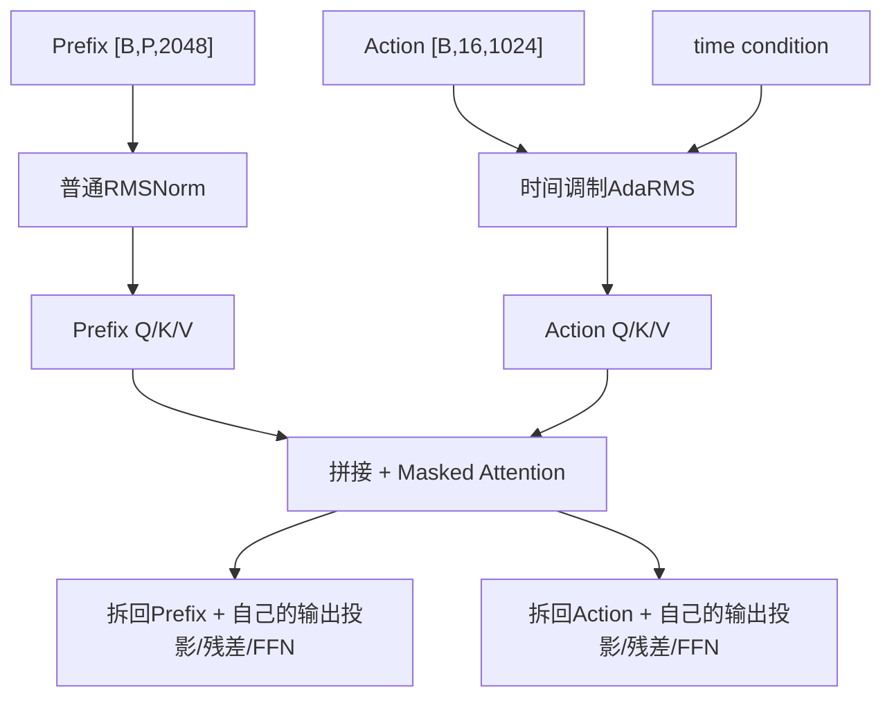

# 02｜Prefix、Suffix、AR mask 与双 Expert Attention

本章解释 π0.5 的结构核心：视觉语言 Prefix 如何作为条件，动作 Suffix 如何读取它，以及两种不同宽度的 Expert 如何在同一个注意力空间交互。

## 1. Prefix：固定条件

入口：`src/openpi/models/pi0.py::Pi0.embed_prefix`。

### 1.1 图像 token

每个有效的 `224×224` 图像经过 SigLIP，得到约 256 个视觉 token：

```text
[B,224,224,3]
  -> SigLIP
[B,256,2048]
```

TidyBench 有两个有效视角和一个 masked padding 视角。`image_mask` 会扩展到该图像的全部 token，确保 padding 图像不参与注意力。

### 1.2 语言和离散状态 token

`tokenized_prompt` 已包含任务指令和离散状态，经过 PaliGemma embedding：

```text
[B,L] token ids
  -> embedding table
[B,L,2048]
```

最后沿序列维拼接：

```text
prefix_tokens = [image tokens, language/state tokens]
shape = [B,P,2048]
```

π0.5 的 Prefix `ar_mask` 全为 `False`，表示所有有效图像、指令和状态 token 同属块 0，可以双向读取。

## 2. Suffix：随去噪变化的动作条件

入口：`src/openpi/models/pi0.py::Pi0.embed_suffix`。

TidyBench 当前动作状态：

```text
x_t：[B,16,32]
  -> action_in_proj(32 -> 1024)
action_tokens：[B,16,1024]
```

时间支路：

```text
t：[B]
  -> sin/cos embedding
  -> 两层MLP + Swish
adarms_cond：[B,1024]
```

π0.5 不在 Suffix 创建连续 state token，因为归一化状态已经在 `TokenizePrompt` 中离散并进入 Prefix。与旧 π0 相比，这是必须区分的结构差异。

`embed_suffix()` 返回：

| 返回值 | TidyBench 形状 | 作用 |
|---|---:|---|
| `tokens` | `[B,16,1024]` | Action Expert 输入 |
| `input_mask` | `[B,16]` | 16 个动作槽均有效 |
| `ar_mask` | `[16]` | 定义新动作块 |
| `adarms_cond` | `[B,1024]` | 调制 Action Expert 各层 |

## 3. 这里的 AR 到底是什么

AR 是 autoregressive 的缩写，但 `ar_mask` 不是简单的“这个 token 能否看前一个 token”。OpenPI 把它当作**是否从此位置开启一个新因果块**的边界标记。

核心代码等价于：

```python
block_id = cumsum(ar_mask)
can_attend[query, key] = block_id[key] <= block_id[query]
```

### 3.1 Prefix

```text
ar_mask： [False, False, False, ...]
block_id：[0,     0,     0, ...]
```

所有 Prefix token 同属块 0，彼此可见。

### 3.2 Action Suffix

```python
[True] + [False] * (action_horizon - 1)
```

当 `H=16`：

```text
ar_mask： [True, False, False, ..., False]
block_id：[1,    1,     1,     ..., 1]
```

第一个动作 token 开启块 1，后面 15 个动作 token 沿用块 1。因此动作块内部不是逐位置自回归，而是整个 action chunk 联合注意。

### 3.3 最终边界

| Query | 能读取 Prefix K/V | 能读取 Action K/V |
|---|---:|---:|
| Prefix | 是 | 否 |
| Action | 是 | 是 |

这保证 Prefix 不会被训练时的带噪动作反向污染，而 Action 可以同时利用视觉语言条件和完整候选动作块。

## 4. 双 Expert 不是简单串联

π0.5 每层包含两套参数：

| Expert | 输入 | width | depth | FFN width |
|---|---|---:|---:|---:|
| PaliGemma Expert | Prefix | 2048 | 18 | 16384 |
| Action Expert | Suffix | 1024 | 18 | 4096 |

它们不共享 RMSNorm、Q/K/V 投影、Attention 输出投影和 FFN 参数。它们共享的是兼容的注意力几何：

```text
num query heads = 8
num KV heads    = 1
head dim        = 256
```

## 5. 不同 width 如何进入同一 Attention

入口：`src/openpi/models/gemma.py::Attention.__call__`。

两套 Expert 各自投影：

```text
Prefix [B,P,2048]
  -> PaliGemma自己的Q/K/V参数
Qp [B,P,8,256], Kp/Vp [B,P,1,256]

Action [B,16,1024]
  -> Action Expert自己的Q/K/V参数
Qa [B,16,8,256], Ka/Va [B,16,1,256]
```

然后只沿 token 序列维拼接：

```text
Q = concat(Qp,Qa, axis=1)
K = concat(Kp,Ka, axis=1)
V = concat(Vp,Va, axis=1)
```

因此不是把 2048 和 1024 直接相加，而是先由各自参数翻译成共同的 Q/K/V 空间。

注意力计算后，再按序列位置拆开：

```text
encoded[:, :P]   -> PaliGemma自己的输出投影 -> [B,P,2048]
encoded[:, P:]   -> Action自己的输出投影    -> [B,16,1024]
```

可以把它概括为：

> 两个 Expert 在 Attention 空间会面，交换信息后回到各自隐藏空间；FFN 阶段继续使用各自参数。

## 6. Multi-Query Attention

这里有 8 个 Query head，但只有 1 个 K/V head：

```text
Q：[B,T,8,256]
K：[B,S,1,256]
V：[B,S,1,256]
```

8 个 Query head 共享 K/V，减少参数、计算和 KV Cache 大小。Attention mask 最终广播到所有 Query head。

## 7. 训练与推理的双 Expert 调用差异

### 7.1 训练：一次联合前向

`compute_loss()` 调用：

```python
llm(
    [prefix_tokens, suffix_tokens],
    mask=attn_mask,
    adarms_cond=[None, adarms_cond],
)
```

每一层同时生成 Prefix 和 Action 的 Q/K/V，再用 mask 控制信息方向。

### 7.2 推理：Prefix 缓存，Action 重复计算

第一次：

```python
llm([prefix_tokens, None]) -> prefix KV cache
```

每个去噪步骤：

```python
llm(
    [None, suffix_tokens],
    kv_cache=prefix_cache,
    adarms_cond=[None, adarms_cond],
)
```

Action Expert 只重新计算当前 `x_t` 的 Q/K/V；源码把 Prefix cache 与 Action K/V 拼接，因此 Action Query 仍能读取全部条件。

这在概念上类似 cross-attention，但实现上没有单独的 Cross-Attention 层，而是“联合 Self-Attention + mask + KV Cache”。

## 8. 一层 Transformer 的信息流



这个过程重复 18 层。跨 token、跨 Expert 的信息融合主要发生在 Attention；各自 FFN 负责在单个 token 内进一步变换特征。

## 9. 阅读验收

1. `ar_mask=True` 表示“禁止注意”还是“开启新块”？
2. 为什么 `[True,False,...]` 不会让动作逐个自回归？
3. Prefix 为什么不能读取 Action，Action 为什么能读取 Prefix？
4. 2048 维和 1024 维为什么可以联合计算 Attention？
5. 训练为什么一次输入两个 Expert，推理为什么分别调用？
6. KV Cache 缓存的是每层的 token，还是投影后的 K/V？

下一章单独下钻时间调制、AdaRMS 和门控残差。

