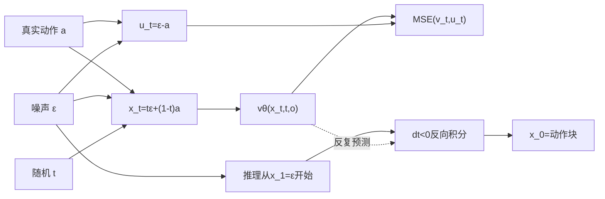

# 04｜Flow Matching：训练和推理闭环

本章解释 π0.5 真正学习的对象。模型不是直接输出最终动作，而是学习条件速度场：

\[
v_\theta(x_t,t,o)
\]

其中 `o` 是图像、指令和状态，`x_t` 是时间 `t` 的带噪动作。

## 1. `compute_loss()` 的输入

入口：`src/openpi/models/pi0.py::Pi0.compute_loss`。

TidyBench batch 中：

```text
observation：三路图像槽、mask、离散状态/指令token等
actions：[B,16,32]
```

这里的 `actions` 已经完成动作块切分、归一化和 7D→32D padding。

## 2. 三类随机数

```python
preprocess_rng, noise_rng, time_rng = jax.random.split(rng, 3)
```

- `preprocess_rng`：训练图像增强；
- `noise_rng`：动作高斯噪声；
- `time_rng`：采样 Flow Matching 时间。

训练图像可能执行裁剪、旋转和颜色增强；这不是机器人状态/动作归一化，后者已经在 DataLoader 中完成。

## 3. 生成噪声和时间

```python
noise = random.normal(noise_rng, actions.shape)
time = random.beta(time_rng, 1.5, 1, batch_shape) * 0.999 + 0.001
```

形状：

```text
actions：[B,16,32]
noise：  [B,16,32]
time：   [B]
```

每个样本的完整动作块共享一个 `t`。`Beta(1.5,1)` 相比均匀分布稍偏向较大的时间，即较强噪声一侧；缩放和平移避免精确采到 `t=0`。

```python
time_expanded = time[..., None, None]
```

将 `[B]` 变为 `[B,1,1]`，以广播到 `[B,16,32]`。

## 4. 构造直线路径 `x_t`

```python
x_t = time_expanded * noise + (1 - time_expanded) * actions
```

记真实动作 `a`、噪声 `ε`：

\[
x_t=t\epsilon+(1-t)a
\]

源码时间约定：

```text
t=0：x_0=a，真实动作
t=1：x_1=ε，纯噪声
```

这与 π0 论文采用的时间方向相反；阅读实现时必须服从源码约定。

## 5. 为什么目标速度是 `noise - actions`

将路径展开：

\[
x_t=a+t(\epsilon-a)
\]

对时间求导：

\[
u_t=\frac{dx_t}{dt}=\epsilon-a
\]

对应源码：

```python
u_t = noise - actions
```

这里的“速度”不是机器人关节/末端速度，而是动作张量在 Flow Matching 路径上的变化率。

## 6. 一个标量例子

设：

```text
真实动作 a = 0.8
噪声   ε = -0.2
```

那么：

```text
u_t = ε-a = -1.0
```

路径为：

| t | x_t |
|---:|---:|
| 0.00 | 0.80 |
| 0.25 | 0.55 |
| 0.50 | 0.30 |
| 0.75 | 0.05 |
| 1.00 | -0.20 |

因为使用直线插值，对于这一对 `a/ε`，目标速度始终为 `-1.0`。

## 7. 为什么速度目标不含 `t`，模型仍需时间条件

训练目标 `ε-a` 对单个配对是常量，但模型看不到原始 `a` 和 `ε`，只能看到：

```text
x_t + t + observation
```

同一个数值的 `x_t` 在不同 `t` 下可能来自不同动作/噪声组合，也代表不同噪声强度。模型必须知道当前处于粗重构还是精修阶段，因此 `t` 经 AdaRMS 注入 Action Expert 各层。

## 8. 模型前向和监督

训练时一次联合前向：

```text
observation
  -> embed_prefix
  -> Prefix [B,P,2048]

x_t,time
  -> embed_suffix
  -> Action tokens [B,16,1024]
  -> adarms_cond [B,1024]

双Expert Transformer
  -> suffix_out [B,16,1024]
  -> action_out_proj(1024->32)
  -> v_t [B,16,32]
```

训练目标：

\[
v_\theta(x_t,t,o)\approx u_t=\epsilon-a
\]

## 9. Loss 形状

JAX 代码：

```python
return mean(square(v_t - u_t), axis=-1)
```

形状变化：

```text
(v_t-u_t)^2：[B,16,32]
对动作维32求均值
chunked_loss：[B,16]
```

`compute_loss()` 保留 batch 和 horizon 维，便于检查每个动作位置的误差。`scripts/train.py::train_step.loss_fn` 再执行：

```python
loss = jnp.mean(chunked_loss)
```

得到用于反向传播的标量。

## 10. 推理为什么从噪声开始

入口：`src/openpi/models/pi0.py::Pi0.sample_actions`。

```python
noise = random.normal([B,16,32])
x_t = noise
time = 1.0
dt = -1.0 / num_steps
```

每一步：

```python
v_t = model(x_t, time, observation)
x_t = x_t + dt * v_t
time = time + dt
```

模型学到的是从动作指向噪声的 `dx/dt`，但推理使用负的 `dt`，所以实际沿路径反向走：

```text
t=1 噪声 -> t=0 动作
```

继续标量例子，`v_t=-1`、`dt=-0.25`：

```text
-0.20 -> 0.05 -> 0.30 -> 0.55 -> 0.80
```

更新式中的两个负号把方向反转回真实动作。

## 11. Prefix KV Cache 在循环中的作用

观测条件不随 10 个左右的去噪步骤变化，所以：

```text
开始：Prefix前向一次，缓存每层K/V
每步：只重新计算当前Action x_t和时间调制
```

每个步骤变化的是 `x_t`、`t`、Action Q/K/V 和 `scale/shift/gate`；不变的是图像、语言、离散状态及其 Prefix K/V。

## 12. 训练与推理闭环



最终应记住：

```text
训练：随机选路径上的一点，学习局部速度
推理：从噪声出发，多次查询速度并积分到动作
```

## 13. 阅读验收

1. `x_t`、`u_t`、`v_t` 分别是什么？
2. 为什么 `u_t=noise-actions`？
3. 为什么 `time` 是 `[B]` 而不是 `[B,16]`？
4. 为什么 `compute_loss()` 返回 `[B,16]`？
5. 训练目标指向噪声，推理为什么仍能生成动作？
6. 这里的速度场为何不是机器人控制速度？

下一章进入梯度更新、多卡训练、EMA 和 checkpoint。

