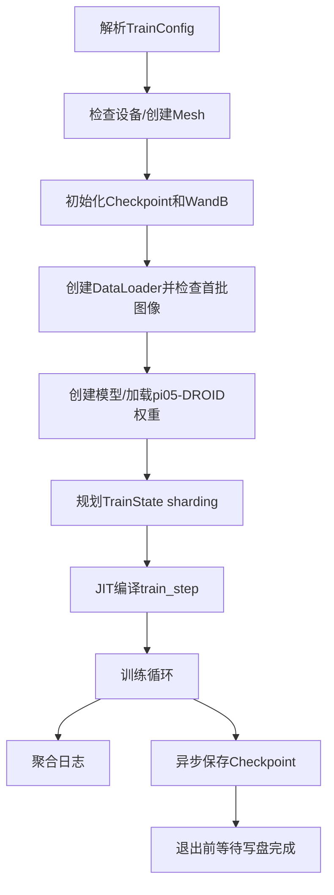

# 05｜训练运行时：梯度、优化器、多卡与 Checkpoint

本章从 `compute_loss()` 得到标量以后继续追踪：Loss 如何变成梯度、参数怎样更新，以及一次训练任务如何被 `main()` 调度。

## 1. `TrainState` 是训练快照

OpenPI `src/openpi/training/utils.py::TrainState` 保存：

| 字段 | 作用 |
|---|---|
| `step` | 当前训练步 |
| `params` | 完整模型参数状态 |
| `model_def` | 不包含具体数组值的模型结构 |
| `tx` | Optax 优化器变换 |
| `opt_state` | AdamW 一阶矩、二阶矩等历史状态 |
| `ema_decay/ema_params` | 可选的参数滑动平均 |

NNX 将模型拆成静态结构和动态数组：

```text
model_def + params -> nnx.merge -> 可执行模型
```

这样 JAX 可以明确知道哪些内容参与 JIT、梯度和设备 sharding。

## 2. `train_step()` 总览

入口：`scripts/train.py::train_step`。

```text
重建model
  -> compute_loss得到标量
  -> value_and_grad反向传播
  -> 过滤冻结参数
  -> 梯度裁剪 + AdamW
  -> apply_updates
  -> 更新TrainState
  -> 可选更新EMA
  -> 返回loss/grad_norm/param_norm
```

## 3. 梯度的直观意义

设单参数损失：

\[
L=(\theta-5)^2
\]

当 `θ=2`：

\[
\frac{\partial L}{\partial\theta}=2(2-5)=-6
\]

负梯度表示增大 `θ` 会降低 Loss。深度模型只是把一个 `θ` 扩展为参数树，JAX 通过计算图为每个可训练数组生成同形状的梯度。

## 4. 生成标量 Loss

`loss_fn()` 调用：

```python
chunked_loss = model.compute_loss(..., train=True)  # [B,16]
loss = jnp.mean(chunked_loss)                       # scalar
```

标量 Loss 才能作为整棵参数树反向传播的统一目标。

## 5. 每个 step 的独立随机数

主循环反复传入同一个基础 key，`train_step()` 使用：

```python
train_rng = jax.random.fold_in(rng, state.step)
```

得到可复现但逐步不同的图像增强、动作噪声和 Flow time。

## 6. 冻结规则与 LoRA

```python
diff_state = nnx.DiffState(0, config.trainable_filter)
loss, grads = nnx.value_and_grad(loss_fn, argnums=diff_state)(model, ...)
```

`0` 指向 `loss_fn` 的第 0 个参数 `model`；`trainable_filter` 只允许未冻结的 `nnx.Param` 产生梯度和进入优化器。

TidyBench 配置使用：

```python
paligemma_variant="gemma_2b_lora"
action_expert_variant="gemma_300m_lora"
freeze_filter=model.get_freeze_filter()
```

配置位置：[`stack_config.py`](../../source/vla_tidybench/openpi/stack_config.py)。其核心意图是冻结匹配到的 LLM 基础参数、排除 LoRA 参数于冻结集合之外；LoRA 适配器和不被 freeze filter 匹配的项目层继续训练。判断具体某个参数是否训练时，以参数路径和 `Pi0Config.get_freeze_filter()` 为准，不要仅凭模块名称猜测。

冻结参数仍参与前向计算，但：

- 不生成优化器需要的梯度树；
- 不创建 AdamW 一阶/二阶矩；
- 不被更新；
- 初始化阶段可转为 bfloat16 以节约显存。

## 7. `value_and_grad()` 做了什么

```python
loss, grads = nnx.value_and_grad(...)(...)
```

一次调用包含：

```text
前向：Observation/Actions -> Flow Matching Loss
反向：Loss -> action_out_proj -> Action Expert -> 双Expert Attention -> 可训练参数
```

梯度形状与参数一致，例如：

```text
action_out_proj.kernel：[1024,32]
对应gradient：          [1024,32]
```

## 8. AdamW 和梯度裁剪

```python
updates, new_opt_state = state.tx.update(grads, state.opt_state, params)
new_params = optax.apply_updates(params, updates)
```

默认优化器链：

```text
clip_by_global_norm(1.0)
  -> AdamW(b1=0.9,b2=0.95,eps=1e-8)
  -> 学习率schedule
```

梯度裁剪计算整棵梯度树的全局范数；超过 1.0 时整体等比例缩小，保留方向，避免异常 batch 产生过大更新。

AdamW 使用历史一阶矩和二阶矩平滑、缩放更新。`tx.update()` 返回的是更新量而不是新参数，Optax 的更新量已包含负学习率方向，因此 `apply_updates` 使用加法应用它。

## 9. 写回完整模型状态

优化器只更新过滤后的可训练参数：

```python
nnx.update(model, new_trainable_params)
new_full_state = nnx.state(model)
```

第一行把新值补回模型，冻结参数保留旧值；第二行重新取出完整参数树。然后：

```text
step      <- step + 1
params    <- new_full_state
opt_state <- new_opt_state
```

## 10. EMA 在通用 OpenPI 中的位置

若 `ema_decay` 非空：

\[
\theta_{EMA}=d\theta_{EMA-old}+(1-d)\theta_{new}
\]

EMA 参数变化更平滑，保存时 OpenPI 优先把它作为推理参数。不过 TidyBench 当前 smoke 配置显式设置 `ema_decay=None`，所以当前 checkpoint 保存的是直接训练参数，不应把通用机制误写成已经启用的项目事实。

## 11. `main()` 的完整生命周期

入口：`scripts/train.py::main`。



### 11.1 设备和 batch 检查

全局 batch size 必须能被 JAX 设备数整除。数据沿 batch 维分给设备，参数根据 FSDP 规则决定复制还是切分。

### 11.2 首批数据检查

程序在模型初始化前取一个 batch，打印所有数组的 shape/dtype，并把前几条多相机画面拼接上传日志。这是检查字段、相机顺序、黑图、形状和数值范围的最早断点。

### 11.3 模型初始化和权重加载

`init_train_state()`：

```text
创建目标π0.5结构
  -> eval_shape得到参数形状而不完整分配
  -> 规划FSDP布局
  -> 加载并校验pi05-DROID checkpoint子树
  -> 合并预训练权重
  -> 创建可训练参数的AdamW状态
```

TidyBench 锁定完整 checkpoint 的明确路径，避免 Orbax 误读之前残缺的下载目录，详见 [`openpi_training.md`](../openpi_training.md)。

## 12. Data Parallel 与 FSDP

OpenPI Mesh 有：

```text
batch axis
fsdp axis
```

以 8 张 GPU 为例：

```text
fsdp_devices=1 -> mesh (8,1)：主要是8路数据并行，每卡完整模型
fsdp_devices=2 -> mesh (4,2)：4个数据并行组，每组2卡切分大参数
```

`fsdp_sharding()` 的简化规则：

- 标量、向量、小于 4 MiB 的数组复制；
- 大矩阵沿最大且可被 FSDP 设备数整除的轴切分；
- 找不到合法切分轴则复制。

本项目已经验证双 RTX 4090、`FSDP_DEVICES=2`、batch 2 的两步 smoke；它证明训练链和显存布局可执行，不证明策略已经学会任务。

## 13. JIT 与 buffer donation

```python
ptrain_step = jax.jit(
    partial(train_step, config),
    in_shardings=(rng_sharding, state_sharding, data_sharding),
    out_shardings=(state_sharding, info_sharding),
    donate_argnums=(1,),
)
```

- 第一次调用编译，后续相同形状复用可执行程序；
- `donate_argnums=(1,)` 允许新 TrainState 复用旧 State buffer，降低峰值显存；
- 旧 State 调用后不可再用，所以代码立即以返回的新 State 覆盖它。

## 14. 日志和 Checkpoint

每步记录：

```text
loss
grad_norm
param_norm
```

日志间隔内先累积再平均，随后从设备取回并打印/上传。Checkpoint 使用 Orbax 异步保存：

```text
assets/      归一化统计
train_state/ step、optimizer state等恢复信息
params/      推理可加载的模型参数
```

训练结束必须调用 `wait_until_finished()`，否则最后一次异步写盘可能未完成。

## 15. 阅读验收

1. `model_def` 与 `params` 为什么分开？
2. `DiffState(0, filter)` 中的 0 指什么？
3. 冻结参数是否还参与前向计算？
4. `tx.update()` 返回新参数还是更新量？
5. 为什么 AdamW checkpoint 必须同时保存 `opt_state`？
6. FSDP 和纯数据并行分别怎样占用模型显存？
7. TidyBench 当前是否启用了 EMA？
8. 两步训练 smoke 能证明什么、不能证明什么？

