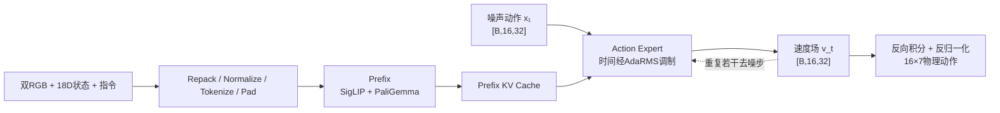

# π0.5 / OpenPI 源码学习手册

这组文档把 VLA-TidyBench 使用的 OpenPI π0.5 训练和推理链整理成可复查的源码笔记。它不是聊天记录，也不追求逐行覆盖 OpenPI；目标是能够独立回答：数据从哪里来、经过哪些模块、张量怎样变化、损失如何产生、动作怎样生成。

## 适用版本与项目边界

- OpenPI：`15a9616a00943ada6c20a0f158e3adb39df2ccac`
- VLA-TidyBench 配置入口：[`stack_config.py`](../../source/vla_tidybench/openpi/stack_config.py)
- 模型：π0.5，PaliGemma `gemma_2b_lora` + Action Expert `gemma_300m_lora`
- 模型动作宽度：32
- action horizon：16，即 20 Hz 下的 0.8 秒动作块
- TidyBench 物理动作：7D `[dx,dy,dz,dRx,dRy,dRz,gripper]`，训练前补零到 32D，推理后裁回 7D
- TidyBench 状态：18D 关节位置/速度；π0.5 在 padding 前将归一化状态离散后放进 Prefix 文本 token

OpenPI 是外部固定版本依赖，没有复制进本仓库。文中的 `src/openpi/...` 和 `scripts/train.py` 均指向上述 OpenPI commit。

## 一页心智模型



三个核心概念：

1. **Prefix**：图像、语言和离散状态，描述“看到了什么、要做什么”。
2. **Suffix**：当前带噪动作块，描述“正在去噪的候选动作”。
3. **Flow Matching**：模型预测动作空间中的速度场，而不是一次直接回归最终动作。

## 建议阅读顺序

| 章节 | 解决的问题 | 主要 OpenPI 入口 |
|---|---|---|
| [01 推理与数据链](01_inference_and_data.md) | 外部观测如何变成模型输入和 7D 动作？ | `policies/policy.py`、`training/data_loader.py`、`transforms.py` |
| [02 Prefix、Suffix 与注意力](02_attention_and_experts.md) | AR mask、块边界和双 Expert 如何交互？ | `models/pi0.py`、`models/gemma.py` |
| [03 时间调制与残差](03_adarms_and_residual.md) | 时间如何逐层调制 Action Expert？残差连接做什么？ | `models/gemma.py::RMSNorm/Block` |
| [04 Flow Matching 闭环](04_flow_matching.md) | `x_t/u_t/v_t` 是什么？训练和推理为何方向相反？ | `models/pi0.py::compute_loss/sample_actions` |
| [05 训练运行时](05_training_runtime.md) | Loss 如何变成参数更新？多卡、EMA 和 checkpoint 如何连接？ | `scripts/train.py`、`training/sharding.py` |
| [06 张量与源码索引](06_tensor_reference.md) | 查维度、调用顺序和关键源码位置 | 全链路速查 |

第一次阅读按 01→05 顺序，不要从 `gemma.py` 第一行开始。以后遇到具体问题，再用第 06 章反查。

## 项目中的训练/部署连接点

```text
Isaac HDF5
  -> scripts/convert_stack_to_lerobot.py
  -> LeRobot dataset
  -> source/vla_tidybench/openpi/{stack,drawer}_config.py
  -> 外部 OpenPI data_loader / train.py
  -> Orbax checkpoint
  -> scripts/smoke_drawer_policy.py
  -> Policy.infer()
  -> policy bridge / action queue / Isaac worker
```

相关项目文档：

- [数据与训练 smoke](../openpi_training.md)
- [动作语义规范](../action_spec.md)
- [部署结构](../deployment.md)

## 学完后的验收问题

- [ ] `Policy.infer()` 为什么先 transform，再添加 batch 维？
- [ ] π0.5 为什么把状态离散后放进 Prefix，而不是单独加入连续 state token？
- [ ] `ar_mask=[True,False,...]` 为什么让动作块内部可以双向注意？
- [ ] 2048 维 PaliGemma 和 1024 维 Action Expert 如何在同一个 Attention 中交互？
- [ ] 时间 `t` 是否直接修改模型权重？`scale/shift/gate` 分别控制什么？
- [ ] `x_t=tε+(1-t)a` 为什么推出 `u_t=ε-a`？
- [ ] 模型学习的是动作、噪声还是速度场？
- [ ] 推理的 `dt` 为什么为负？
- [ ] `compute_loss()` 的 `[B,H]` 在哪里变成标量？
- [ ] `nnx.value_and_grad`、Optax、EMA 和 Orbax 分别负责什么？
- [ ] 18D 状态、7D 物理动作和 32D 模型动作之间在哪里转换？

不能回答某一项时，只回到对应章节，不需要重新从仓库入口读起。

